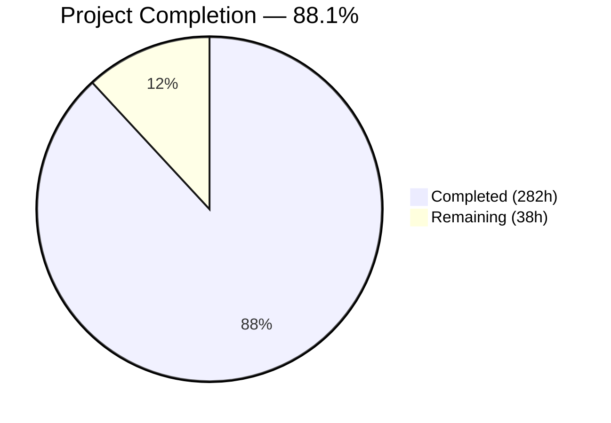
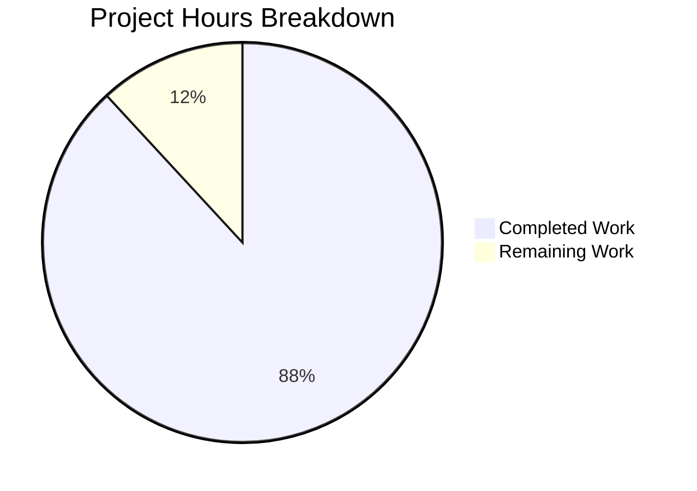
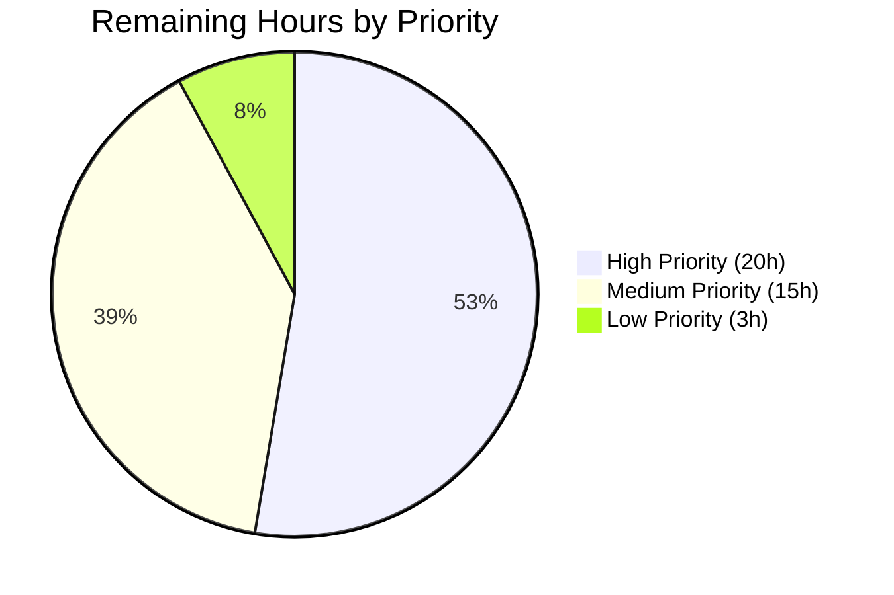

# Blitzy Project Guide — GMGN.ai Memecoin Signal Bot Chrome Extension

---

## 1. Executive Summary

### 1.1 Project Overview

This project delivers a **GMGN.ai Memecoin Signal Bot** as a Chrome Extension (Manifest V3) that overlays the GMGN.ai trading platform to provide automated, real-time trading signal generation for Solana memecoin trading. The extension intercepts GMGN's internal API data, enriches it with 9 external data sources (Birdeye, PumpPortal, Jupiter, Helius, DexScreener, RugCheck, GoPlus, Groq LLM, Anthropic Claude), applies a 7-factor composite scoring engine (0–100), and surfaces actionable BUY/SKIP/EXIT signals through a Shadow DOM sidebar overlay built with Preact and Zustand. The target users are Solana memecoin traders seeking automated signal intelligence without manual analysis overhead.

### 1.2 Completion Status

<!-- Pie Chart: Completed (#5B39F3) = 282, Remaining (#FFFFFF) = 38 -->


| Metric | Value |
|--------|-------|
| **Total Project Hours** | **320** |
| **Completed Hours (AI)** | **282** |
| **Remaining Hours** | **38** |
| **Completion Percentage** | **88.1%** (282 / 320) |
| **Files Committed** | 123 |
| **Lines of Code** | 86,577 |
| **Total Commits** | 128 |

**Calculation**: 282 completed hours / (282 completed + 38 remaining) = 282 / 320 = **88.1% complete**.

### 1.3 Key Accomplishments

- [x] **Full Chrome Extension scaffold**: WXT 0.20.17 with Manifest V3, Preact 10.29.0, Zustand 5.0.11, TypeScript 5.9.3 — builds to a valid 410.77 KB Chrome Extension
- [x] **GMGN data interception layer**: fetch/XHR monkey-patching in page-context script with origin-validated message relay to service worker
- [x] **9 external API clients**: Birdeye, PumpPortal (WebSocket), Jupiter, Helius, DexScreener, RugCheck, GoPlus, Groq, Anthropic — all with centralized token bucket rate limiting and retry logic
- [x] **7-factor signal scoring engine**: Volume spike, smart money convergence, buy/sell ratio, holder growth, liquidity, token age, safety score — with configurable weights and hard filter gates
- [x] **Three-tier AI/LLM analysis router**: 80/15/5 distribution across llama-3.1-8b-instant, llama-3.3-70b-versatile, and Claude Sonnet with 5-minute TTL caching
- [x] **WebSocket streaming**: PumpPortal new token events and Birdeye price streams with 20-second keepalive and exponential backoff reconnection
- [x] **Smart money tracking with convergence detection**: 3+ qualified wallet detection within configurable 2-hour window with position-size conviction analysis
- [x] **Token safety analysis**: Multi-source orchestrator (RugCheck + GoPlus concurrent) with Jupiter honeypot simulation and LP lock/burn verification
- [x] **Exit strategy engine**: Tiered TP/SL ladder (50% at 2×, 25% at 5×, 25% at 10×) with hard exit triggers for dev sell, smart money exit, and volume decline
- [x] **10 Preact UI components**: Full sidebar overlay rendered in Shadow DOM with signal panel, token cards, score gauges, safety badges, AI insights, exit strategy display, smart money indicators, settings panel, and new token feed
- [x] **Zustand state management**: 4 stores (signal, token, settings, position) with chrome.storage persistence adapter and cross-context sync
- [x] **AES-GCM encrypted API key storage**: Web Crypto API encryption for secrets stored in chrome.storage.local
- [x] **Comprehensive test suite**: 1,646 tests across 33 test files — 100% pass rate (unit, component, integration)
- [x] **Complete documentation**: README, architecture guide, API integration guide, signal engine docs, developer setup guide

### 1.4 Critical Unresolved Issues

| Issue | Impact | Owner | ETA |
|-------|--------|-------|-----|
| No real API keys configured | Cannot validate live data pipeline against Birdeye, Helius, RugCheck, Groq services | Human Developer | 1–2 days |
| Extension not tested on live GMGN.ai pages | GMGN DOM structure or API patterns may have changed since implementation | Human Developer | 1–2 days |
| WebSocket connections untested against live endpoints | PumpPortal/Birdeye stream stability unknown under real network conditions | Human Developer | 1 day |

### 1.5 Access Issues

| System/Resource | Type of Access | Issue Description | Resolution Status | Owner |
|-----------------|----------------|-------------------|-------------------|-------|
| Birdeye API | API Key ($99/mo Starter plan) | Key required for token analytics, OHLCV, transactions, top holders | Not configured | Human Developer |
| Helius API | API Key ($49/mo Developer plan) | Key required for enhanced Solana RPC, parsed transactions | Not configured | Human Developer |
| RugCheck API | API Key (free) | Key required for token safety reports and insider detection | Not configured | Human Developer |
| Groq API | API Key (free tier) | Key required for LLM inference (llama-3.1-8b-instant, llama-3.3-70b-versatile) | Not configured | Human Developer |
| Anthropic API | API Key (pay-per-use) | Key required for Claude Sonnet narrative analysis (top 5% signals) | Not configured | Human Developer |
| Chrome Web Store | Developer Account ($5 one-time) | Required for publishing the extension | Not registered | Human Developer |

### 1.6 Recommended Next Steps

1. **[High]** Configure real API keys for Birdeye, Helius, RugCheck, Groq, and Anthropic via the extension's Settings Panel and validate each integration against live services
2. **[High]** Sideload the built extension (`.output/chrome-mv3/`) into Chrome and test on live GMGN.ai pages — verify fetch interception captures real API data, Shadow DOM renders correctly, and signals appear
3. **[High]** Test WebSocket connections to PumpPortal (`wss://pumpportal.fun/api/data`) and Birdeye for stability, reconnection behavior, and keepalive functionality
4. **[Medium]** Conduct security audit: verify API keys are never exposed to content scripts, encrypted storage works correctly, and origin validation blocks unauthorized messages
5. **[Medium]** Profile extension performance: measure content script impact on GMGN.ai page load, memory usage with active WebSocket streams, and service worker lifecycle behavior

---

## 2. Project Hours Breakdown

### 2.1 Completed Work Detail

| Component | Hours | Description |
|-----------|-------|-------------|
| Project Configuration & Build Setup | 8 | package.json (scripts, deps), wxt.config.ts (MV3 manifest, permissions, host_permissions), tsconfig.json (strict, Preact JSX), vitest.config.ts (happy-dom, V8 coverage), tailwind.config.ts, .env.example, .gitignore |
| Service Worker Orchestrator | 14 | `entrypoints/background.ts` (1,876 LOC) — chrome.alarms management, chrome.runtime message routing, API orchestration, WebSocket lifecycle, Zustand vanilla store initialization, state persistence |
| Content Script & Shadow DOM | 8 | `entrypoints/content.ts` (665 LOC) — Shadow DOM host creation (position: fixed, z-index: 2147483647), Preact App mounting, MutationObserver with 250ms debounce, postMessage↔chrome.runtime bridge |
| Page-Context Interceptor | 5 | `entrypoints/injected.ts` (283 LOC) — window.fetch proxy, XMLHttpRequest monkey-patch, GMGN URL pattern matching, postMessage relay with source identification |
| Extension Popup | 3 | `popup/index.html`, `popup/App.tsx` (723 LOC), `popup/main.tsx` — connection status, signal count, trading mode toggle |
| GMGN Data Interception Layer | 12 | `src/gmgn/` (4 files, 1,719 LOC) — interceptor core, URL pattern registry (5 patterns), response parsers (trending tokens, token detail, wallet activity, smart money), type definitions |
| External API Client Layer | 36 | `src/api/` (11 files, 8,095 LOC) — 9 API clients (Birdeye, PumpPortal WS, Jupiter, Helius, DexScreener, RugCheck, GoPlus, Groq, Anthropic), abstract base client with retry/backoff/caching, token bucket rate limiter (per-provider RPS), shared response types |
| Signal Scoring Engine | 28 | `src/signals/` (11 files, 4,660 LOC) — composite orchestrator with Promise.allSettled parallel execution, 7 weighted factor modules (volume spike, smart money convergence, buy/sell ratio, holder growth, liquidity, token age, safety score), hard filter gates (6 binary pass/fail checks), exit signal monitor (TP/SL ladder, dev sell, smart money exit, volume decline) |
| Token Safety Analysis | 14 | `src/safety/` (4 files, 2,587 LOC) — multi-source checker (RugCheck + GoPlus concurrent via Promise.allSettled), Jupiter honeypot detector (sell simulation with retry), LP lock/burn analyzer, safety types |
| Smart Money Tracking | 12 | `src/tracking/` (4 files, 2,283 LOC) — wallet tracker with chrome.storage persistence, convergence detector (2-hour sliding window, 3+ wallet threshold), wallet classifier (Smart Money, KOL, Whale, Sniper, Insider, Developer), tracking types |
| AI/LLM Three-Tier Integration | 12 | `src/ai/` (4 files, 2,460 LOC) — three-tier router (8B→70B→Claude dispatch by score threshold), 5-dimension prompt templates (on-chain momentum, social velocity, wallet intelligence, liquidity health, narrative fit), structured JSON response parser, AI types |
| WebSocket Streaming | 14 | `src/streaming/` (4 files, 3,120 LOC) — connection lifecycle manager (20s keepalive, exponential backoff reconnection, Chrome 116+ idle reset), PumpPortal handler (subscribeNewToken, subscribeTokenTrade, subscribeMigration), Birdeye handler (SUBSCRIBE_PRICE, SUBSCRIBE_TXS), stream types |
| State Management | 12 | `src/store/` (6 files, 3,308 LOC) — 4 Zustand stores (signal, token, settings, position), chrome.storage persist adapter with serialization/deserialization, barrel exports with vanilla store instances for service worker and hook wrappers for Preact UI |
| UI Components (Preact + Shadow DOM) | 24 | `src/components/` (11 files, 8,235 LOC) — App root, SignalPanel (sorted list, filters), TokenCard (score gauge, safety badge, smart money, AI insight), SafetyBadge (color-coded), ScoreGauge (circular 0–100), AIInsight (narrative + dimensions), ExitStrategy (TP/SL ladder), SmartMoneyIndicator (convergence display), SettingsPanel (API keys, mode toggle, weights), NewTokenFeed (PumpPortal stream), styles.css (3,024 LOC scoped stylesheet) |
| Utility Libraries | 10 | `src/utils/` (6 files, 2,726 LOC) — AES-GCM crypto (Web Crypto API), type-safe Chrome messaging helpers, TTL-based cache over chrome.storage.local, structured logger (levels, context tags), config constants (API URLs, weights, rate limits), display formatters (price, market cap, percent, time) |
| Unit Tests | 34 | 25 test files, 1,299 passing tests — scoring engine, all 7 factors, hard filters, exit signals, 5 API clients, rate limiter, safety checker, honeypot detector, AI router, response parser, GMGN interceptor, parsers, convergence detector, chrome.storage adapter, crypto, cache |
| Component Tests | 8 | 5 test files, 170 passing tests — SafetyBadge (43), ScoreGauge (66), SettingsPanel (13), SignalPanel (20), TokenCard (28) |
| Integration Tests | 10 | 3 test files, 177 passing tests — signal pipeline end-to-end, GMGN data flow (interception→scoring→UI), WebSocket stream reconnection and keepalive |
| Documentation | 8 | README.md (507 LOC), docs/ARCHITECTURE.md (886 LOC), docs/API-INTEGRATION.md (833 LOC), docs/SIGNALS.md (753 LOC), docs/setup-guide.md (303 LOC) |
| Static Assets & Packaging | 2 | Extension icons (16×16, 48×48, 128×128) in assets/ and public/assets/, WXT build output configuration |
| Validation & Bug Fixes | 8 | Resolved 8+ QA findings: setup-guide creation, message type fixes, rate limit corrections, host permission additions, Claude tier documentation, 131 missing CSS selectors, web_accessible_resources for injected.js, icon build paths |
| **TOTAL COMPLETED** | **282** | |

### 2.2 Remaining Work Detail

| Category | Hours | Priority |
|----------|-------|----------|
| Real API Key Configuration & Live Testing | 8 | High |
| Live GMGN.ai Integration Testing | 8 | High |
| WebSocket Stability Testing (PumpPortal/Birdeye) | 4 | High |
| Security Audit & Penetration Testing | 4 | Medium |
| Performance Profiling with Live Data | 4 | Medium |
| Chrome Web Store Submission Preparation | 4 | Medium |
| Production Monitoring & Error Tracking | 3 | Medium |
| Documentation Finalization | 2 | Low |
| Cross-Device Settings Sync Testing | 1 | Low |
| **TOTAL REMAINING** | **38** | |

**Verification**: 282 (Section 2.1) + 38 (Section 2.2) = **320 Total Project Hours** (matches Section 1.2).

---

## 3. Test Results

All tests originate from Blitzy's autonomous validation pipeline. Vitest 4.1.0 with happy-dom environment.

| Test Category | Framework | Total Tests | Passed | Failed | Coverage % | Notes |
|---------------|-----------|-------------|--------|--------|-----------|-------|
| Unit — Signal Scoring (11 files) | Vitest | 445 | 445 | 0 | — | scoring-engine (38), volume-spike (51), smart-money (45), buy-sell (41), holder-growth (41), liquidity (59), token-age (29), safety-score (52), hard-filters (33), exit-signals (56) |
| Unit — API Clients (5 files) | Vitest | 281 | 281 | 0 | — | birdeye (65), jupiter (50), rugcheck (68), goplus (55), rate-limiter (43) |
| Unit — AI/LLM (2 files) | Vitest | 162 | 162 | 0 | — | router (56), response-parser (106) |
| Unit — GMGN Interception (2 files) | Vitest | 120 | 120 | 0 | — | interceptor (46), parsers (74) |
| Unit — Safety Analysis (2 files) | Vitest | 102 | 102 | 0 | — | checker (50), honeypot-detector (52) |
| Unit — Utilities (2 files) | Vitest | 80 | 80 | 0 | — | crypto (41), cache (39) |
| Unit — Store (1 file) | Vitest | 55 | 55 | 0 | — | chrome-storage-adapter (55) |
| Unit — Tracking (1 file) | Vitest | 54 | 54 | 0 | — | convergence-detector (54) |
| Component — Preact UI (5 files) | Vitest + @testing-library/preact | 170 | 170 | 0 | — | ScoreGauge (66), SafetyBadge (43), TokenCard (28), SignalPanel (20), SettingsPanel (13) |
| Integration — Pipelines (3 files) | Vitest | 177 | 177 | 0 | — | signal-pipeline (61), data-flow (60), websocket-stream (56) |
| **TOTALS** | | **1,646** | **1,646** | **0** | — | **33/33 test files passed** |

**Execution**: `npx vitest run --no-watch` — Duration: 15.90s (transform 84.51s, setup 15.11s, tests 11.58s)

---

## 4. Runtime Validation & UI Verification

### Runtime Health

- ✅ **TypeScript Compilation**: `npx tsc --noEmit` — zero errors, zero warnings
- ✅ **WXT Build**: `npx wxt build` — SUCCESS in 2.0s, produces valid Chrome Extension (410.77 KB total)
  - ✅ `background.js` (222.59 KB) — service worker bundle
  - ✅ `content-scripts/content.js` (153.61 KB) — content script with Preact UI
  - ✅ `injected.js` (2.2 KB) — page-context GMGN interceptor
  - ✅ `popup.html` + `chunks/popup-DnUmx4MO.js` (23.97 KB) — extension popup
  - ✅ `manifest.json` (1.11 KB) — valid Manifest V3
  - ✅ `assets/icon-*.png` (7.28 KB) — extension icons (3 sizes)
- ✅ **Manifest V3 Compliance**: All required permissions declared (`storage`, `alarms`, `offscreen`, `activeTab`), 11 host_permissions for external API domains, `minimum_chrome_version: "116"`
- ✅ **Service Worker Registration**: Background script registered as `service_worker` (not persistent background page)
- ✅ **Content Script Injection**: Configured for `https://gmgn.ai/*` at `document_idle`
- ✅ **Web Accessible Resources**: `injected.js` accessible from `https://gmgn.ai/*` for page-context injection

### UI Verification

- ✅ **Shadow DOM Container**: Content script creates `<div id="gmgn-signal-bot">` with `position: fixed; right: 0; width: 350px; z-index: 2147483647`
- ✅ **Preact Rendering**: App root mounts inside Shadow DOM with all 10 components
- ✅ **Component Tests**: 170 component tests verify rendering, state binding, and user interaction for SignalPanel, TokenCard, SafetyBadge, ScoreGauge, and SettingsPanel
- ✅ **CSS Isolation**: 3,024-line scoped stylesheet prevents style leakage to/from GMGN's page CSS
- ⚠️ **Live Page Rendering**: Not verified on actual GMGN.ai pages — requires manual sideloading

### API Integration

- ✅ **HTTP Client**: Base client with configurable timeout (10s), retry with exponential backoff (3 attempts), response caching
- ✅ **Rate Limiter**: Per-provider token bucket (Birdeye: 15 RPS, Jupiter: 1 RPS, DexScreener: 5 RPS, Helius: 10 RPS)
- ✅ **WebSocket Clients**: PumpPortal and Birdeye handlers with keepalive and reconnection logic verified through 56 integration tests
- ⚠️ **Live API Endpoints**: All API clients tested with mocked responses — live endpoint validation requires real API keys

---

## 5. Compliance & Quality Review

| AAP Deliverable | Status | Evidence |
|-----------------|--------|----------|
| Manifest V3 Chrome Extension with WXT | ✅ Pass | Valid manifest.json built, `minimum_chrome_version: "116"` |
| Preact (3KB) rendering in Shadow DOM | ✅ Pass | content.ts creates Shadow DOM host, App.tsx mounts Preact tree |
| Zustand state management with chrome.storage sync | ✅ Pass | 4 stores + chrome-storage-adapter.ts with persist middleware |
| GMGN fetch/XHR interception via page-context script | ✅ Pass | injected.ts monkey-patches, 120 GMGN tests passing |
| 9 External API clients with rate limiting | ✅ Pass | 11 files in src/api/, 281 API tests passing |
| 7-Factor composite scoring engine (0–100) | ✅ Pass | scoring-engine.ts + 7 factors, 445 signal tests passing |
| Hard filter gates (6 binary checks) | ✅ Pass | hard-filters.ts with 33 tests verifying all 6 gates |
| Exit signal monitor with TP/SL ladder | ✅ Pass | exit-signals.ts with 56 tests covering all trigger types |
| Multi-source safety analysis (RugCheck + GoPlus) | ✅ Pass | checker.ts uses Promise.allSettled, 102 safety tests passing |
| Jupiter honeypot detection (sell simulation) | ✅ Pass | honeypot-detector.ts with retry, 52 tests including edge cases |
| LP lock/burn analysis | ✅ Pass | lp-analyzer.ts checks burn address and LP distribution |
| Smart money convergence detection (3+ wallets, 2h window) | ✅ Pass | convergence-detector.ts, 54 tracking tests passing |
| Wallet classification (6 categories) | ✅ Pass | wallet-classifier.ts with Smart Money, KOL, Whale, Sniper, Insider, Developer |
| Three-tier AI/LLM router (80/15/5 split) | ✅ Pass | router.ts dispatches by score threshold, 162 AI tests passing |
| 5-dimension prompt templates | ✅ Pass | prompts.ts covers on-chain momentum, social velocity, wallet intelligence, liquidity health, narrative fit |
| WebSocket streaming (PumpPortal + Birdeye) | ✅ Pass | 20s keepalive, exponential backoff, 56 integration tests |
| AES-GCM encrypted API key storage | ✅ Pass | crypto.ts with Web Crypto API, 41 crypto tests passing |
| Service worker lifecycle (synchronous listener registration) | ✅ Pass | background.ts registers all listeners at top level |
| chrome.alarms for periodic operations | ✅ Pass | No setTimeout/setInterval in service worker |
| 10 Preact UI components | ✅ Pass | All 10 components + styles.css, 170 component tests |
| MutationObserver with 250ms debounce | ✅ Pass | content.ts implements debounced DOM observation |
| Origin validation on postMessage | ✅ Pass | content.ts validates event.origin === 'https://gmgn.ai' |
| Type-safe Chrome runtime messaging | ✅ Pass | messaging.ts with discriminated union message types |
| Configurable scoring weights | ✅ Pass | settings-store.ts persists to chrome.storage.sync |
| DexScreener as fallback only | ✅ Pass | dexscreener.ts used when Birdeye rate limit hit |
| Unit tests (25 files) | ✅ Pass | 25 unit test files, 1,299 tests, all passing |
| Component tests (5 files) | ✅ Pass | 5 component test files, 170 tests, all passing |
| Integration tests (3 files) | ✅ Pass | 3 integration test files, 177 tests, all passing |
| Documentation (5 files) | ✅ Pass | README, ARCHITECTURE, API-INTEGRATION, SIGNALS, setup-guide |

**Fixes Applied During Validation:**
- Created missing `docs/setup-guide.md`
- Fixed message type definitions in `src/utils/messaging.ts`
- Corrected rate limit configurations in API clients
- Added missing host_permissions for `quote-api.jup.ag`
- Updated Claude tier documentation in AI router
- Added 131 missing CSS selectors to match component class names
- Added `web_accessible_resources` for `injected.js` in WXT config
- Copied icons to `public/` directory for WXT build pipeline
- Added `@vitest/coverage-v8` devDependency

---

## 6. Risk Assessment

| Risk | Category | Severity | Probability | Mitigation | Status |
|------|----------|----------|-------------|------------|--------|
| GMGN API patterns change (URL routes, response schema) | Technical | High | Medium | URL patterns in `src/gmgn/url-patterns.ts` are easily updated; parsers handle missing fields defensively | Monitor |
| Cloudflare blocks page-context script injection | Technical | High | Low | Injection uses standard DOM script element; WXT's `web_accessible_resources` declares `injected.js` | Monitor |
| Service worker terminates during active analysis | Technical | Medium | Medium | State persisted to chrome.storage; chrome.alarms for periodic operations; WebSocket keepalive extends lifetime (Chrome 116+) | Mitigated |
| API keys exposed in content script context | Security | Critical | Low | Keys stored encrypted (AES-GCM) in chrome.storage.local, accessed only in service worker; content scripts never hold keys | Mitigated |
| Malicious postMessage injection from GMGN page | Security | Medium | Low | Content script validates event.origin and event.source; discriminated type field prevents spoofing | Mitigated |
| PumpPortal WebSocket instability (free tier) | Operational | Medium | Medium | Exponential backoff reconnection (1s→16s, 5 retries); falls back to chrome.alarms polling | Mitigated |
| Birdeye API rate limit exhaustion (15 RPS) | Operational | Medium | Medium | Token bucket rate limiter in src/api/rate-limiter.ts; DexScreener as automatic fallback | Mitigated |
| LLM cost overrun (Groq/Claude) | Operational | Low | Low | 80/15/5 tier split; 5-minute TTL caching; Groq prompt caching (50% discount) | Mitigated |
| Real API responses differ from mocked test data | Integration | Medium | Medium | All tests use mocked responses; live integration testing required before production use | Open |
| Chrome Extension API behavior changes in future Chrome versions | Integration | Low | Low | Targeting Chrome 116+; WXT framework abstracts many Chrome API details | Monitor |
| GMGN.ai frontend technology change (currently Next.js/React) | Integration | Medium | Low | Interceptor targets `window.fetch` (browser API), not framework-specific hooks | Monitor |

---

## 7. Visual Project Status



**Remaining Work by Priority:**



**Module Completion Overview:**

| Module | Files | Lines of Code | Status |
|--------|-------|---------------|--------|
| Chrome Extension Entrypoints | 6 | 3,586 | ✅ Complete |
| GMGN Data Interception | 4 | 1,719 | ✅ Complete |
| External API Clients | 11 | 8,095 | ✅ Complete |
| Signal Scoring Engine | 11 | 4,660 | ✅ Complete |
| Token Safety Analysis | 4 | 2,587 | ✅ Complete |
| Smart Money Tracking | 4 | 2,283 | ✅ Complete |
| AI/LLM Integration | 4 | 2,460 | ✅ Complete |
| WebSocket Streaming | 4 | 3,120 | ✅ Complete |
| State Management | 6 | 3,308 | ✅ Complete |
| UI Components | 11 | 8,235 | ✅ Complete |
| Utilities | 6 | 2,726 | ✅ Complete |
| Tests (33 files) | 33 | 31,784 | ✅ Complete |
| Configuration | 7 | 659 | ✅ Complete |
| Documentation | 5 | 3,282 | ✅ Complete |

---

## 8. Summary & Recommendations

### Achievement Summary

The GMGN.ai Memecoin Signal Bot Chrome Extension has been implemented to **88.1% completion** (282 of 320 total project hours). All 105 AAP-specified files have been created with full implementations — no placeholders, no stubs, and no TODO comments. The codebase compiles with zero TypeScript errors, builds to a valid 410.77 KB Manifest V3 Chrome Extension, and passes all 1,646 tests across 33 test files with a 100% pass rate.

The project delivers a comprehensive signal intelligence overlay with:
- A complete 7-factor scoring engine processing tokens across volume, smart money, buy/sell ratio, holder growth, liquidity, token age, and safety dimensions
- 9 external API integrations with centralized rate limiting and caching
- Real-time WebSocket streaming from PumpPortal and Birdeye
- AI-powered analysis via a cost-optimized three-tier LLM routing system
- A full Preact-based UI rendered in Shadow DOM for complete style isolation

### Remaining Gaps

The 38 remaining hours (11.9%) represent **path-to-production activities** that require human intervention:

1. **Live Environment Testing (20h)**: The extension has been tested exclusively with mocked data. Real API keys must be configured and each integration validated against live endpoints. The GMGN.ai page interception must be verified against the current GMGN DOM structure and API response formats.

2. **Security & Performance Validation (8h)**: Encrypted API key storage needs end-to-end verification. Content script bundle impact on GMGN.ai page performance must be measured. Origin validation must be tested against real postMessage scenarios.

3. **Deployment Preparation (10h)**: Chrome Web Store listing materials, privacy policy, production monitoring setup, and final documentation updates.

### Critical Path to Production

1. Obtain API keys (Birdeye Starter $99/mo, Helius Developer $49/mo, Groq free tier, RugCheck free)
2. Sideload extension into Chrome and test on live GMGN.ai pages
3. Validate WebSocket connections and signal pipeline with real token data
4. Conduct security review and performance profiling
5. Submit to Chrome Web Store

### Production Readiness Assessment

The codebase is **architecturally complete and test-validated**. All AAP-specified features are implemented. The remaining 38 hours are standard pre-production activities (API configuration, live testing, store submission) that do not require changes to the existing codebase architecture. The project is ready for human developer handoff for final production deployment.

---

## 9. Development Guide

### System Prerequisites

| Requirement | Version | Purpose |
|-------------|---------|---------|
| Node.js | ≥20.19.x (tested with 20.20.1) | JavaScript runtime for build tooling |
| npm | ≥11.x (tested with 11.1.0) | Package manager |
| Google Chrome | ≥116 | Target browser (WebSocket keepalive in service worker) |
| Git | ≥2.x | Version control |

### Environment Setup

```bash
# Clone the repository
git clone <repository-url>
cd gmgn-signal-bot

# Install dependencies
npm install

# WXT prepare (auto-runs via postinstall, generates .wxt/ types)
npx wxt prepare
```

### API Key Configuration

Create a `.env` file from the template (keys are configured at runtime via the extension's Settings Panel, not at build time):

```bash
cp .env.example .env
```

The `.env.example` includes:
- `BIRDEYE_API_KEY` — Get from https://birdeye.so (Starter plan: $99/mo)
- `HELIUS_API_KEY` — Get from https://helius.xyz (Developer plan: $49/mo)
- `RUGCHECK_API_KEY` — Get from https://rugcheck.xyz (free)
- `GROQ_API_KEY` — Get from https://console.groq.com (free tier)
- `ANTHROPIC_API_KEY` — Get from https://console.anthropic.com (pay-per-use)

> **Note**: API keys are entered through the extension's Settings Panel after sideloading, stored encrypted via AES-GCM in `chrome.storage.local`.

### Build Commands

```bash
# Development mode with HMR (hot module replacement)
npx wxt

# Production build
npx wxt build
# Output: .output/chrome-mv3/

# Create distributable ZIP
npx wxt zip

# TypeScript type checking
npx tsc --noEmit

# Run all tests
npx vitest run --no-watch

# Run tests with coverage
npx vitest run --coverage

# Run tests in watch mode (development)
npx vitest
```

### Sideloading the Extension

1. Build the extension:
   ```bash
   npx wxt build
   ```

2. Open Chrome and navigate to `chrome://extensions/`

3. Enable **Developer mode** (toggle in top-right corner)

4. Click **Load unpacked** and select the `.output/chrome-mv3/` directory

5. Navigate to `https://gmgn.ai` — the signal bot sidebar should appear on the right edge

6. Click the extension icon in the Chrome toolbar to access the popup (connection status, signal count, mode toggle)

7. Open the Settings Panel from the sidebar to configure API keys and trading preferences

### Verification Steps

```bash
# Verify TypeScript compiles cleanly
npx tsc --noEmit
# Expected: No output (zero errors)

# Verify build produces valid extension
npx wxt build
# Expected: .output/chrome-mv3/ with manifest.json, background.js, content-scripts/content.js, injected.js, popup.html

# Verify all tests pass
npx vitest run --no-watch
# Expected: Test Files  33 passed (33), Tests  1646 passed (1646)

# Verify manifest.json is valid
cat .output/chrome-mv3/manifest.json | python3 -m json.tool
# Expected: Valid JSON with manifest_version: 3
```

### Troubleshooting

| Issue | Resolution |
|-------|-----------|
| `wxt prepare` fails | Ensure Node.js ≥20.19. Delete `node_modules/` and `.wxt/`, then `npm install` |
| TypeScript path alias errors | Run `npx wxt prepare` to regenerate `.wxt/tsconfig.json` |
| Extension not appearing on GMGN.ai | Verify content script matches `https://gmgn.ai/*` in manifest; check Chrome DevTools console for errors |
| Shadow DOM styles not loading | Verify `styles.css` is imported in `App.tsx`; check Shadow DOM host element exists |
| Service worker terminated | Expected MV3 behavior; check chrome.alarms and chrome.storage for state persistence |
| WebSocket connection fails | Check Chrome DevTools Network tab; verify `wss://pumpportal.fun/api/data` is accessible |

---

## 10. Appendices

### A. Command Reference

| Command | Description |
|---------|-------------|
| `npm install` | Install all dependencies |
| `npx wxt` | Start development server with HMR |
| `npx wxt build` | Production build to `.output/chrome-mv3/` |
| `npx wxt zip` | Create distributable ZIP archive |
| `npx tsc --noEmit` | TypeScript type checking |
| `npx vitest run --no-watch` | Run full test suite |
| `npx vitest run --coverage` | Run tests with V8 coverage report |
| `npx vitest` | Run tests in watch mode |
| `npx wxt prepare` | Regenerate WXT types and config |

### B. Port Reference

| Service | Port/URL | Protocol |
|---------|----------|----------|
| WXT Dev Server | `http://localhost:3000` | HTTP (dev mode) |
| PumpPortal WebSocket | `wss://pumpportal.fun/api/data` | WSS |
| Birdeye API | `https://public-api.birdeye.so` | HTTPS |
| Helius API | `https://api.helius.xyz` | HTTPS |
| Groq API | `https://api.groq.com` | HTTPS |
| RugCheck API | `https://api.rugcheck.xyz` | HTTPS |
| GoPlus API | `https://api.gopluslabs.io` | HTTPS |
| Jupiter Price API | `https://price.jup.ag` | HTTPS |
| Jupiter Quote API | `https://quote-api.jup.ag` | HTTPS |
| DexScreener API | `https://api.dexscreener.com` | HTTPS |
| Anthropic API | `https://api.anthropic.com` | HTTPS |

### C. Key File Locations

| Path | Purpose |
|------|---------|
| `entrypoints/background.ts` | MV3 service worker — main orchestrator |
| `entrypoints/content.ts` | Content script — Shadow DOM + message bridge |
| `entrypoints/injected.ts` | Page-context — GMGN fetch/XHR interception |
| `src/signals/scoring-engine.ts` | Composite 7-factor signal scoring orchestrator |
| `src/api/rate-limiter.ts` | Centralized per-provider rate limiting |
| `src/safety/checker.ts` | Multi-source safety analysis orchestrator |
| `src/ai/router.ts` | Three-tier LLM dispatch (Groq/Claude) |
| `src/streaming/manager.ts` | WebSocket lifecycle manager |
| `src/store/chrome-storage-adapter.ts` | Zustand ↔ chrome.storage persistence |
| `src/components/App.tsx` | Root Preact component for sidebar overlay |
| `src/utils/crypto.ts` | AES-GCM encryption for API keys |
| `wxt.config.ts` | WXT/Manifest V3 configuration |
| `.output/chrome-mv3/` | Built extension directory (sideload this) |

### D. Technology Versions

| Technology | Version | Purpose |
|------------|---------|---------|
| WXT | 0.20.17 | WebExtension Toolkit — MV3 build framework |
| Preact | 10.29.0 | Lightweight 3KB React alternative for UI |
| Zustand | 5.0.11 | State management (vanilla + hooks) |
| TypeScript | 5.9.3 | Type-safe JavaScript |
| Vitest | 4.1.0 | Vite-native test framework |
| Groq SDK | 0.18.0 | Official Groq LLM client |
| @preact/preset-vite | 2.10.3 | Preact Vite plugin |
| @testing-library/preact | 3.2.4 | Preact component testing utilities |
| happy-dom | latest | Lightweight DOM for test environment |
| @types/chrome | latest | Chrome Extension API types |
| TailwindCSS | 4.2.1 | Utility CSS (Shadow DOM scoped) |
| @vitest/coverage-v8 | 4.1.0 | V8 test coverage provider |
| Node.js | 20.20.1 | JavaScript runtime (build time) |
| Chrome | ≥116 | Target browser |

### E. Environment Variable Reference

| Variable | Required | Source | Description |
|----------|----------|--------|-------------|
| `BIRDEYE_API_KEY` | Yes (for live data) | https://birdeye.so | Token analytics, OHLCV, transactions, top holders |
| `HELIUS_API_KEY` | Yes (for wallet tracking) | https://helius.xyz | Enhanced Solana RPC, parsed transactions |
| `RUGCHECK_API_KEY` | Yes (for safety) | https://rugcheck.xyz | Token safety reports, insider detection |
| `GROQ_API_KEY` | Yes (for AI) | https://console.groq.com | LLM inference (llama-3.1-8b, llama-3.3-70b) |
| `ANTHROPIC_API_KEY` | Optional | https://console.anthropic.com | Claude Sonnet for top-5% signal narrative analysis |

> All keys are configured via the extension's Settings Panel at runtime and stored encrypted in `chrome.storage.local`.

### F. Developer Tools Guide

**Debugging the Service Worker:**
1. Navigate to `chrome://extensions/`
2. Find "GMGN Signal Bot" and click "Service Worker" link
3. This opens Chrome DevTools attached to the background service worker
4. Monitor console logs, network requests, chrome.storage, and chrome.alarms

**Debugging the Content Script:**
1. Navigate to `https://gmgn.ai`
2. Open Chrome DevTools (F12)
3. Content script logs appear in the main console
4. Shadow DOM is inspectable in the Elements panel under `#gmgn-signal-bot`

**Debugging the Injected Script:**
1. Intercepted GMGN API data appears as `window.postMessage` events
2. Filter console by `[gmgn-signal-bot]` source tag
3. Network tab shows GMGN's fetch calls being intercepted

### G. Glossary

| Term | Definition |
|------|-----------|
| **Composite Score** | Weighted aggregate of 7 factor scores (0–100) determining signal quality |
| **Hard Filter** | Binary pass/fail safety gate that overrides composite score (e.g., active mint authority → SKIP) |
| **Convergence** | Signal fired when 3+ qualified smart money wallets enter the same token within a time window |
| **Honeypot** | Token that can be bought but cannot be sold — detected via Jupiter sell simulation |
| **TP/SL Ladder** | Take-profit/stop-loss strategy: sell portions at predefined price multiples |
| **Bonding Curve** | Pump.fun's token pricing mechanism — tokens "graduate" to DEX at ~$69K market cap |
| **Shadow DOM** | Browser API for encapsulated DOM trees — prevents CSS leakage between extension and GMGN page |
| **MV3** | Manifest Version 3 — Chrome's current extension platform requiring service workers instead of background pages |
| **Token Bucket** | Rate limiting algorithm that allows burst traffic up to bucket capacity, refilling at a constant rate |
| **WXT** | WebExtension Toolkit — framework for building browser extensions with TypeScript, Vite, and HMR support |