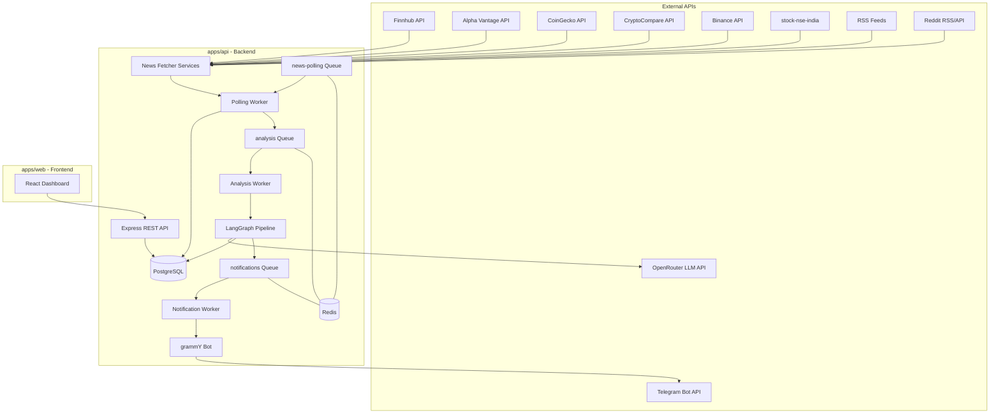

# Technical Specification

# 0. Agent Action Plan

## 0.1 Intent Clarification


### 0.1.1 Core Feature Objective

Based on the prompt, the Blitzy platform understands that the new feature requirement is to **build a complete, production-ready Trading Intelligence Application** — a multi-market financial news analysis platform that aggregates news from 30+ sources, processes articles through a tiered AI analysis pipeline, and delivers actionable trade recommendations via Telegram bot and a React web dashboard.

The core feature requirements are:

- **Multi-Market News Aggregation** — Ingest financial news and social sentiment from US stocks, Indian equities (NSE/BSE), and cryptocurrency markets using a curated stack of free APIs (Finnhub, CoinGecko, CryptoCompare) and RSS feeds (Economic Times, Financial Express, Business Standard, Reddit)
- **AI-Powered Analysis Pipeline** — Implement a four-stage LangGraph.js directed graph (Filter → Sentiment → Trade Detection → Recommendation) with conditional short-circuiting that routes only ~25% of articles to the expensive recommendation model, achieving ~75% LLM cost reduction
- **Tiered OpenRouter Model Strategy** — Integrate OpenRouter as a unified LLM gateway using `ChatOpenAI` with custom `baseURL`, deploying DeepSeek V3.2 for filtering ($0.25/1M tokens), Claude Haiku 4.5 for sentiment and trade detection ($1.00/$5.00), and Claude Sonnet 4.6 for recommendations ($3.00/$15.00)
- **Telegram Bot Interface** — Build a grammY-based Telegram bot with `/start`, `/settings`, `/status` commands, inline keyboards for preference configuration, and MarkdownV2-formatted trade alert messages with emoji indicators (🟢 LONG / 🔴 SHORT)
- **Job Queue Infrastructure** — Deploy BullMQ with Redis 7 for three distinct queues: `news-polling` (5-minute cron interval), `analysis` (LangGraph pipeline processing), and `notifications` (Telegram alert delivery) with configurable concurrency, rate limiting, and priority levels
- **PostgreSQL Database with Drizzle ORM** — Design 7 core tables (`news_articles`, `trade_opportunities`, `trade_performance`, `user_settings`, `api_sources`, `analysis_logs`, `notification_logs`) with proper indexing on timestamp and symbol columns, supporting both local PostgreSQL and Supabase
- **React Web Dashboard** — Create a dark-themed, responsive React + Vite + TypeScript frontend with sidebar navigation, live news feed, trade opportunities board with filters, historical performance charts, and settings management
- **Monorepo Architecture** — Structure the project as a Turborepo + pnpm workspaces monorepo with `apps/api` (Express backend), `apps/web` (React frontend), and shared `packages/` (types, config, utils)
- **Observability and Monitoring** — Integrate Pino structured logging, Bull Board queue dashboard at `/admin/queues`, health checks with dependency status, Bottleneck rate limiters for all external APIs, and error boundaries in React
- **Docker-Based Local Development** — Provide Docker Compose with PostgreSQL 16 and Redis 7 services, multi-stage Dockerfiles, PM2 cluster mode for production, and Vercel deployment config for the frontend

Implicit requirements detected:

- **URL-based deduplication** — News articles must be deduplicated by URL to prevent redundant analysis and notifications
- **Financial decimal precision** — All price fields must use PostgreSQL `numeric(12,4)` to avoid floating-point precision errors in financial calculations
- **MarkdownV2 character escaping** — All special characters in Telegram messages must be escaped with `\\` per grammY/Telegram Bot API requirements
- **Supabase transaction pooler compatibility** — Drizzle ORM connection must use `prepare: false` when connecting via Supabase's pgBouncer
- **Environment-based configuration toggle** — The system must support seamless switching between local PostgreSQL and Supabase via environment variables without code changes
- **Anti-hallucination safeguards** — All LLM-generated price targets must be validated against actual market data from APIs to prevent fabricated financial data
- **Rate limit isolation** — Each external API source requires its own Bottleneck limiter instance configured to its specific free-tier limits

### 0.1.2 Special Instructions and Constraints

- **Feature-based code organization** — Organize by feature vertical (data → API → UI → behavior), NOT by layer (frontend/backend splits), to prevent mismatched interfaces
- **Zod schemas serve dual purpose** — Zod schemas defined in the specification become both the data contract documentation AND the actual runtime validation code for structured LLM output
- **Temperature = 0 for all financial analysis** — All LLM calls in the pipeline must use `temperature: 0` for deterministic, reproducible financial reasoning
- **DK-CoT prompting** — Use Domain Knowledge Chain-of-Thought prompting that incorporates financial domain knowledge into reasoning chains for improved sentiment accuracy
- **Negative news weighting** — Negative financial news has 2–3x the market impact of positive news; the analysis pipeline must weight detection accordingly
- **Phased implementation with validation gates** — Each of the 10 implementation phases must have a concrete validation test; without them, the AI coding assistant may produce plausible-looking code that fails on edge cases
- **Context clearing between phases** — Execute one phase at a time with context clearing to prevent context pollution that degrades code quality in long sessions
- **Multi-document specification structure** — The specification follows a multi-document approach (`CLAUDE.md` for rules, `docs/specification.md` for the master spec, `docs/implementation-plan.md` for phased execution) rather than a monolithic prompt

User Example — Recommended data source stack:

| Market | News Sources | Price Data |
|---|---|---|
| US Stocks | Finnhub news (free, 60/min) + CNBC/MarketWatch RSS | Finnhub quotes + Alpha Vantage historical |
| Indian Equities | Economic Times + Financial Express + Business Standard RSS feeds | stock-nse-india (free) or Kite Connect (₹500/mo) |
| Crypto | CryptoCompare + CoinGecko trending | Binance API (free) + CoinGecko |
| Social | Reddit RSS (free) + Reddit API (100 QPM free) | N/A |

User Example — Tiered model cost strategy:

| Pipeline Step | Recommended Model | Cost (input/output per 1M tokens) | Rationale |
|---|---|---|---|
| Filtering | DeepSeek V3.2 | $0.25 / $0.38 | Binary classification, high volume |
| Sentiment | Claude Haiku 4.5 | $1.00 / $5.00 | Nuanced language understanding |
| Trade Detection | Claude Haiku 4.5 | $1.00 / $5.00 | Moderate analytical reasoning |
| Recommendation | Claude Sonnet 4.6 | $3.00 / $15.00 | Complex reasoning, precise output |

### 0.1.3 Technical Interpretation

These feature requirements translate to the following technical implementation strategy:

- To **build the monorepo scaffold**, we will create a Turborepo v2.8.x + pnpm workspaces project with `apps/api` (Node.js Express), `apps/web` (React + Vite), and `packages/` (types, config, utils), including shared `tsconfig.json`, ESLint, Prettier, and Docker Compose with PostgreSQL 16 + Redis 7
- To **implement the database layer**, we will create Drizzle ORM v0.45.x schema definitions for all 7 tables using `drizzle-orm/pg-core`, configure `drizzle-kit` for migration generation, and implement a connection module that toggles between local PostgreSQL (`pg` driver) and Supabase (`postgres` driver with `prepare: false`)
- To **build the news ingestion layer**, we will create API client services for Finnhub REST API, an RSS parser using the `rss-parser` npm package for Indian market and CNBC/MarketWatch feeds, Reddit RSS integration, CoinGecko/CryptoCompare API clients, and Binance REST endpoints — all protected by per-API Bottleneck rate limiter instances
- To **implement the AI analysis pipeline**, we will create a four-node LangGraph.js v1.2.x `StateGraph` with `Annotation`-based typed state, conditional edges for early termination, `ChatOpenAI` with OpenRouter `baseURL` for multi-model routing, and `withStructuredOutput()` with Zod schemas for parseable trade recommendations
- To **build the Telegram bot**, we will create a grammY v1.41.x bot with command handlers (`/start`, `/settings`, `/status`), inline keyboard builders for preference management, MarkdownV2 message formatter with proper character escaping, and integration with the BullMQ notification queue
- To **implement the job queue system**, we will create three BullMQ v5.x queues (`news-polling`, `analysis`, `notifications`) with Redis 7 connection, repeatable cron jobs for 5-minute polling, configurable worker concurrency, priority levels (breaking news = priority 1), and exponential backoff retry policies
- To **build the REST API**, we will create Express routes for paginated news feed, filterable/sortable trade opportunities, performance tracking endpoints, user settings CRUD, and a health check endpoint with dependency status reporting
- To **create the React dashboard**, we will build a Vite + React + TypeScript SPA with dark theme, responsive sidebar navigation, live news feed page, trade opportunities board with filter controls, historical performance visualization with charts, and a settings configuration page
- To **implement observability**, we will integrate Pino v10.x structured JSON logging with child loggers for context, Bull Board v6.20.x Express middleware at `/admin/queues`, and Bottleneck rate limiters for all external API calls
- To **configure deployment**, we will create multi-stage Dockerfiles (deps → build → production with non-root user), a PM2 ecosystem file for backend cluster mode, Vercel frontend deployment config, and a comprehensive `.env.example` documenting all required environment variables


## 0.2 Repository Scope Discovery


### 0.2.1 Comprehensive File Analysis

The repository is a **greenfield project** — it contains only a single `README.md` file with the content `# quick-repo-6`. There are no existing source files, configurations, dependencies, build scripts, CI/CD pipelines, or infrastructure definitions. Every component of the trading intelligence application must be created from scratch.

**Existing file inventory (complete):**

| Path | Status | Action Required |
|---|---|---|
| `README.md` | UNCHANGED | MODIFY — Replace placeholder with comprehensive project documentation |

**Integration point discovery (all new):**

Since the repository is empty, all integration points must be created. The following represents the complete set of new modules and their interconnections:

- **API endpoints** — Express router modules under `apps/api/src/routes/` exposing `/api/news`, `/api/opportunities`, `/api/performance`, `/api/settings`, `/api/health`
- **Database models** — Drizzle ORM schema files under `apps/api/src/db/schema/` defining all 7 tables with relations and indexes
- **Service classes** — Business logic services under `apps/api/src/services/` for news fetching, analysis orchestration, notification dispatch, and user preference management
- **Queue definitions** — BullMQ queue and worker modules under `apps/api/src/queues/` for `news-polling`, `analysis`, and `notifications`
- **Bot handlers** — grammY bot command and callback handlers under `apps/api/src/bot/` for Telegram interaction
- **LangGraph pipeline** — Analysis graph definition under `apps/api/src/services/analyzer/` with node functions for filter, sentiment, trade detection, and recommendation
- **Middleware** — Express middleware under `apps/api/src/middleware/` for error handling, request logging, CORS, and rate limiting

### 0.2.2 New File Requirements — Complete Monorepo Structure

**Root-level configuration files:**

| File | Purpose |
|---|---|
| `pnpm-workspace.yaml` | Define pnpm workspace packages (apps/*, packages/*) |
| `turbo.json` | Turborepo task pipeline configuration (build, dev, lint, test) |
| `package.json` | Root package.json with workspace scripts and turbo devDependency |
| `tsconfig.base.json` | Shared TypeScript base configuration (strict mode, ESM) |
| `.eslintrc.js` | Root ESLint configuration with TypeScript rules |
| `.prettierrc` | Prettier formatting rules |
| `.gitignore` | Git ignore patterns (node_modules, dist, .turbo, .env) |
| `docker-compose.yml` | Local dev services (PostgreSQL 16, Redis 7, backend, frontend) |
| `.env.example` | All required environment variables documented |
| `README.md` | Comprehensive project documentation (MODIFY existing) |

**`apps/api/` — Node.js Express backend:**

| File | Purpose |
|---|---|
| `apps/api/package.json` | Backend dependencies and scripts |
| `apps/api/tsconfig.json` | Backend TypeScript configuration extending base |
| `apps/api/Dockerfile` | Multi-stage Docker build (deps → build → prod) |
| `apps/api/ecosystem.config.js` | PM2 cluster mode configuration |
| `apps/api/drizzle.config.ts` | Drizzle Kit migration configuration |
| `apps/api/src/index.ts` | Application entry point — Express server bootstrap |
| `apps/api/src/config/env.ts` | Environment variable validation and typed config |
| `apps/api/src/config/constants.ts` | Application constants (API URLs, queue names, defaults) |
| `apps/api/src/db/index.ts` | Drizzle ORM connection (local PG / Supabase toggle) |
| `apps/api/src/db/schema/news-articles.ts` | `news_articles` table schema |
| `apps/api/src/db/schema/trade-opportunities.ts` | `trade_opportunities` table schema |
| `apps/api/src/db/schema/trade-performance.ts` | `trade_performance` table schema |
| `apps/api/src/db/schema/user-settings.ts` | `user_settings` table schema |
| `apps/api/src/db/schema/api-sources.ts` | `api_sources` table schema |
| `apps/api/src/db/schema/analysis-logs.ts` | `analysis_logs` table schema |
| `apps/api/src/db/schema/notification-logs.ts` | `notification_logs` table schema |
| `apps/api/src/db/schema/index.ts` | Schema barrel export |
| `apps/api/src/db/schema/enums.ts` | Shared PostgreSQL enum definitions (market, direction, status) |
| `apps/api/src/db/schema/relations.ts` | Drizzle ORM table relations |
| `apps/api/src/db/seed.ts` | Database seed script with sample data |
| `apps/api/src/db/migrations/` | Auto-generated SQL migration files directory |
| `apps/api/src/routes/index.ts` | Express router aggregator |
| `apps/api/src/routes/news.routes.ts` | GET /api/news (paginated, filterable) |
| `apps/api/src/routes/opportunities.routes.ts` | GET /api/opportunities (filterable, sortable) |
| `apps/api/src/routes/performance.routes.ts` | GET /api/performance (tracking endpoints) |
| `apps/api/src/routes/settings.routes.ts` | CRUD /api/settings (user preferences) |
| `apps/api/src/routes/health.routes.ts` | GET /api/health (dependency status) |
| `apps/api/src/services/news-fetcher/index.ts` | News fetcher service orchestrator |
| `apps/api/src/services/news-fetcher/finnhub.ts` | Finnhub API client (US stock news + quotes) |
| `apps/api/src/services/news-fetcher/rss-parser.ts` | RSS feed parser (Indian markets, CNBC, MarketWatch) |
| `apps/api/src/services/news-fetcher/reddit.ts` | Reddit RSS/API client (social sentiment) |
| `apps/api/src/services/news-fetcher/coingecko.ts` | CoinGecko API client (crypto trending + data) |
| `apps/api/src/services/news-fetcher/cryptocompare.ts` | CryptoCompare API client (crypto news + data) |
| `apps/api/src/services/news-fetcher/binance.ts` | Binance REST API client (crypto price data) |
| `apps/api/src/services/news-fetcher/alpha-vantage.ts` | Alpha Vantage API client (historical data + sentiment) |
| `apps/api/src/services/news-fetcher/nse-india.ts` | stock-nse-india wrapper (Indian equity prices) |
| `apps/api/src/services/analyzer/index.ts` | LangGraph.js analysis pipeline orchestrator |
| `apps/api/src/services/analyzer/state.ts` | Annotation-based typed state definition |
| `apps/api/src/services/analyzer/nodes/filter.ts` | Filter node (DeepSeek V3.2 — binary relevance) |
| `apps/api/src/services/analyzer/nodes/sentiment.ts` | Sentiment node (Claude Haiku 4.5 — nuanced analysis) |
| `apps/api/src/services/analyzer/nodes/trade-detect.ts` | Trade detection node (Claude Haiku 4.5 — opportunity ID) |
| `apps/api/src/services/analyzer/nodes/recommend.ts` | Recommendation node (Claude Sonnet 4.6 — structured output) |
| `apps/api/src/services/analyzer/schemas.ts` | Zod schemas for structured LLM output |
| `apps/api/src/services/analyzer/prompts.ts` | System prompts for all 4 pipeline stages |
| `apps/api/src/services/analyzer/models.ts` | OpenRouter model configuration and ChatOpenAI instances |
| `apps/api/src/services/notifier/index.ts` | Notification service (subscriber matching + dispatch) |
| `apps/api/src/services/notifier/formatter.ts` | MarkdownV2 trade alert message formatter |
| `apps/api/src/queues/index.ts` | Queue registry and connection setup |
| `apps/api/src/queues/news-polling.queue.ts` | News polling queue definition (5-min cron) |
| `apps/api/src/queues/analysis.queue.ts` | Analysis queue definition (pipeline processing) |
| `apps/api/src/queues/notifications.queue.ts` | Notification queue definition (Telegram alerts) |
| `apps/api/src/queues/workers/news-polling.worker.ts` | News polling worker (fetches + deduplicates) |
| `apps/api/src/queues/workers/analysis.worker.ts` | Analysis worker (runs LangGraph pipeline) |
| `apps/api/src/queues/workers/notifications.worker.ts` | Notification worker (sends Telegram messages) |
| `apps/api/src/bot/index.ts` | grammY bot initialization and middleware setup |
| `apps/api/src/bot/commands/start.ts` | /start command handler (user registration) |
| `apps/api/src/bot/commands/settings.ts` | /settings command handler (inline keyboard prefs) |
| `apps/api/src/bot/commands/status.ts` | /status command handler (system health summary) |
| `apps/api/src/bot/keyboards.ts` | Inline keyboard builders for preference UI |
| `apps/api/src/bot/callbacks.ts` | Callback query handlers for inline keyboard actions |
| `apps/api/src/lib/logger.ts` | Pino logger factory with child logger support |
| `apps/api/src/lib/rate-limiter.ts` | Bottleneck rate limiter instances per API source |
| `apps/api/src/lib/openrouter.ts` | OpenRouter ChatOpenAI client factory |
| `apps/api/src/middleware/error-handler.ts` | Global Express error handling middleware |
| `apps/api/src/middleware/request-logger.ts` | HTTP request logging middleware (pino-http) |
| `apps/api/src/middleware/cors.ts` | CORS configuration middleware |

**`apps/web/` — React + Vite + TypeScript frontend:**

| File | Purpose |
|---|---|
| `apps/web/package.json` | Frontend dependencies and scripts |
| `apps/web/tsconfig.json` | Frontend TypeScript configuration |
| `apps/web/vite.config.ts` | Vite build configuration with proxy |
| `apps/web/vercel.json` | Vercel deployment configuration |
| `apps/web/index.html` | HTML entry point |
| `apps/web/src/main.tsx` | React app bootstrap |
| `apps/web/src/App.tsx` | Root application component with routing |
| `apps/web/src/styles/globals.css` | Global CSS with dark theme variables |
| `apps/web/src/layouts/DashboardLayout.tsx` | Sidebar navigation layout shell |
| `apps/web/src/pages/NewsFeed.tsx` | Live news feed page with infinite scroll |
| `apps/web/src/pages/TradeOpportunities.tsx` | Trade opportunities board with filters |
| `apps/web/src/pages/Performance.tsx` | Historical performance with charts |
| `apps/web/src/pages/Settings.tsx` | User settings configuration page |
| `apps/web/src/components/NewsCard.tsx` | News article card component |
| `apps/web/src/components/TradeCard.tsx` | Trade opportunity card component |
| `apps/web/src/components/FilterBar.tsx` | Filter/sort controls component |
| `apps/web/src/components/PerformanceChart.tsx` | Performance chart visualization |
| `apps/web/src/components/Sidebar.tsx` | Sidebar navigation component |
| `apps/web/src/components/HealthIndicator.tsx` | System health status indicator |
| `apps/web/src/hooks/useApi.ts` | Generic API hook with loading/error states |
| `apps/web/src/hooks/useNews.ts` | News feed data hook |
| `apps/web/src/hooks/useOpportunities.ts` | Trade opportunities data hook |
| `apps/web/src/lib/api-client.ts` | Axios/fetch API client configuration |
| `apps/web/src/types/index.ts` | Frontend-specific type definitions |

**`packages/` — Shared workspace packages:**

| File | Purpose |
|---|---|
| `packages/types/package.json` | Shared types package config |
| `packages/types/tsconfig.json` | Types TypeScript config |
| `packages/types/src/index.ts` | Barrel export for all shared types |
| `packages/types/src/news.ts` | News article interfaces and enums |
| `packages/types/src/trade.ts` | Trade opportunity and performance types |
| `packages/types/src/user.ts` | User settings and preference types |
| `packages/types/src/api.ts` | API request/response type definitions |
| `packages/types/src/queue.ts` | Queue job payload type definitions |
| `packages/config/package.json` | Shared config package |
| `packages/config/tsconfig.json` | Shared TypeScript base config |
| `packages/config/eslint.js` | Shared ESLint configuration |
| `packages/utils/package.json` | Shared utilities package |
| `packages/utils/tsconfig.json` | Utils TypeScript config |
| `packages/utils/src/index.ts` | Barrel export for utilities |
| `packages/utils/src/formatting.ts` | Number/currency/date formatting helpers |
| `packages/utils/src/validation.ts` | Shared Zod validation schemas |

**Test files:**

| File | Purpose |
|---|---|
| `apps/api/tests/unit/services/news-fetcher.test.ts` | News fetcher service unit tests |
| `apps/api/tests/unit/services/analyzer.test.ts` | LangGraph pipeline unit tests |
| `apps/api/tests/unit/services/notifier.test.ts` | Notification service unit tests |
| `apps/api/tests/unit/queues/workers.test.ts` | Queue worker unit tests |
| `apps/api/tests/unit/bot/commands.test.ts` | Bot command handler unit tests |
| `apps/api/tests/integration/news-ingestion.test.ts` | End-to-end news ingestion test |
| `apps/api/tests/integration/analysis-pipeline.test.ts` | Full pipeline integration test |
| `apps/api/tests/integration/notification-delivery.test.ts` | Notification dispatch integration test |
| `apps/api/tests/integration/api-routes.test.ts` | REST API endpoint integration tests |
| `apps/web/src/__tests__/pages/NewsFeed.test.tsx` | News feed page component tests |
| `apps/web/src/__tests__/pages/TradeOpportunities.test.tsx` | Trade board page tests |
| `apps/web/src/__tests__/components/NewsCard.test.tsx` | News card component tests |

### 0.2.3 Web Search Research Conducted

The following research was completed to inform implementation decisions:

- **LangGraph.js v1.2.2** — Confirmed as latest npm version; uses `Annotation` API for typed state, `StateGraph` for graph construction, conditional edges for routing, and built-in `RetryPolicy` for LLM failure handling
- **grammY v1.41.1** — Confirmed as latest npm version; native TypeScript with 1.2M+ weekly downloads; plugin ecosystem for conversations, files, inline keyboards
- **Drizzle ORM v0.45.1** — Confirmed as latest stable npm version (v1.0 in beta); ~7.4 KB bundle; supports PostgreSQL, Supabase (with `prepare: false`); validator packages (drizzle-zod) now consolidated into main drizzle-orm imports
- **BullMQ v5.71.0** — Confirmed as latest npm version; supports repeatable cron jobs, flow producers, configurable concurrency, rate limiting, priority levels 1–2,097,152
- **Pino v10.3.1** — Confirmed as latest npm version (v10.x, not v9.x as initially referenced); 5x faster than alternatives; worker-thread transports via `pino.transport` API
- **Turborepo v2.8.16** — Confirmed as latest npm version; pnpm workspace integration; content-aware caching; parallel task execution based on dependency graph
- **@bull-board/express v6.20.3** — Confirmed as latest; provides web dashboard for BullMQ queue monitoring via Express middleware
- **Node.js 24.x LTS "Krypton"** — Confirmed as current Active LTS (latest 24.14.0); uses OpenSSL 3.5 with security level 2; EOL April 2028
- **Indian market API coverage** — Confirmed that Finnhub, Polygon, and FMP do NOT cover NSE/BSE; RSS feeds + `stock-nse-india` npm package is the recommended free approach
- **OpenRouter integration pattern** — Confirmed that `ChatOpenAI` from `@langchain/openai` with custom `baseURL: "https://openrouter.ai/api/v1"` is the officially documented pattern


## 0.3 Dependency Inventory


### 0.3.1 Private and Public Packages

All packages are public and sourced from the **npm** registry. No private packages are required. The repository currently contains no `package.json` or any dependency manifest — every dependency listed below must be installed fresh.

**Runtime — Core Platform Dependencies (`apps/api`):**

| Registry | Package | Version | Purpose |
|---|---|---|---|
| npm | `express` | ^4.21.x | HTTP server framework for REST API and middleware |
| npm | `grammy` | ^1.41.1 | Telegram Bot framework (TypeScript-native) |
| npm | `drizzle-orm` | ^0.45.1 | TypeScript ORM for PostgreSQL schema and queries |
| npm | `bullmq` | ^5.71.0 | Redis-based job queue for news polling, analysis, notifications |
| npm | `@langchain/langgraph` | ^1.2.2 | Directed graph framework for AI analysis pipeline |
| npm | `@langchain/openai` | ^0.5.x | ChatOpenAI class for OpenRouter model integration |
| npm | `@langchain/core` | ^0.3.x | LangChain core abstractions (messages, prompts, output parsers) |
| npm | `pino` | ^10.3.1 | Structured JSON logger (5x faster than Winston) |
| npm | `pino-http` | ^10.x | HTTP request/response logging middleware |
| npm | `zod` | ^3.24.x | Schema validation for LLM structured output and API input |
| npm | `pg` | ^8.13.x | PostgreSQL client driver for Drizzle ORM |
| npm | `postgres` | ^3.4.x | PostgreSQL client (alternative driver for Supabase) |
| npm | `ioredis` | ^5.6.x | Redis client for BullMQ connection |
| npm | `bottleneck` | ^2.19.5 | Per-API rate limiter with configurable reservoirs |
| npm | `rss-parser` | ^3.13.x | RSS/Atom feed parser for Indian market news feeds |
| npm | `cors` | ^2.8.x | Express CORS middleware |
| npm | `dotenv` | ^16.4.x | Environment variable loader from .env files |
| npm | `helmet` | ^8.0.x | Express security headers middleware |
| npm | `@bull-board/api` | ^6.19.0 | Bull Board core API for queue monitoring dashboard |
| npm | `@bull-board/express` | ^6.20.3 | Bull Board Express adapter for mounting dashboard UI |
| npm | `stock-nse-india` | ^2.1.x | NSE India scraper for Indian equity real-time quotes |

**Runtime — Frontend Dependencies (`apps/web`):**

| Registry | Package | Version | Purpose |
|---|---|---|---|
| npm | `react` | ^19.1.x | UI component library |
| npm | `react-dom` | ^19.1.x | React DOM renderer |
| npm | `react-router-dom` | ^7.x | Client-side routing |
| npm | `recharts` | ^2.15.x | Charting library for performance visualization |
| npm | `axios` | ^1.8.x | HTTP client for API requests |
| npm | `clsx` | ^2.1.x | Conditional className utility |
| npm | `date-fns` | ^4.x | Date formatting and manipulation |

**Development Dependencies (root and per-app):**

| Registry | Package | Version | Purpose |
|---|---|---|---|
| npm | `turbo` | ^2.8.16 | Turborepo build system for monorepo orchestration |
| npm | `typescript` | ~5.9.x | TypeScript compiler (avoiding 6.0 RC/Go rewrite volatility) |
| npm | `drizzle-kit` | ^0.30.x | Drizzle ORM CLI for migration generation and schema push |
| npm | `vite` | ^6.2.x | Frontend build tool and dev server |
| npm | `@vitejs/plugin-react` | ^4.4.x | Vite React plugin with Fast Refresh |
| npm | `vitest` | ^3.0.x | Test runner (Vite-native, Jest-compatible) |
| npm | `pino-pretty` | ^13.1.x | Dev-only colorized Pino log output |
| npm | `tsx` | ^4.19.x | TypeScript execution for Node.js (dev runner) |
| npm | `eslint` | ^9.x | Linting engine |
| npm | `prettier` | ^3.5.x | Code formatter |
| npm | `@types/express` | ^5.x | Express type definitions |
| npm | `@types/pg` | ^8.x | PostgreSQL client type definitions |
| npm | `@types/cors` | ^2.8.x | CORS middleware type definitions |
| npm | `@types/node` | ^22.x | Node.js type definitions |
| npm | `@types/react` | ^19.x | React type definitions |
| npm | `@types/react-dom` | ^19.x | React DOM type definitions |

**Infrastructure Dependencies (Docker / Deployment):**

| Component | Version | Purpose |
|---|---|---|
| PostgreSQL | 16.x | Primary relational database (via Docker or Supabase) |
| Redis | 7.x | BullMQ job queue backing store (appendonly persistence) |
| Node.js | 24.x LTS | Runtime (Active LTS "Krypton", EOL April 2028) |
| pnpm | ^9.x | Package manager for monorepo workspaces |
| PM2 | ^5.x | Production process manager with cluster mode |
| Docker | 24.x+ | Container runtime for local development |
| Docker Compose | 2.x+ | Multi-service container orchestration |

### 0.3.2 Dependency Updates

Since this is a greenfield project, there are no existing imports to transform. All imports will be established fresh following these patterns:

**Backend import conventions (`apps/api/src/**/*.ts`):**

```typescript
import { drizzle } from "drizzle-orm/node-postgres";
import { Queue, Worker } from "bullmq";
```

**Frontend import conventions (`apps/web/src/**/*.tsx`):**

```typescript
import { useEffect, useState } from "react";
import { BarChart, Bar, XAxis } from "recharts";
```

**Shared package references via workspace protocol in `package.json`:**

```json
{ "dependencies": { "@trading-intelligence/types": "workspace:*" } }
```

**External reference configuration files requiring setup:**

| File Pattern | Configuration Required |
|---|---|
| `apps/api/drizzle.config.ts` | Database connection URL, schema path, migration output directory |
| `turbo.json` | Task pipeline definitions (build, dev, lint, test), environment variable passthrough |
| `pnpm-workspace.yaml` | Workspace package paths (`apps/*`, `packages/*`) |
| `docker-compose.yml` | PostgreSQL 16, Redis 7 service definitions with healthchecks |
| `.env.example` | All API keys (OPENROUTER_API_KEY, FINNHUB_API_KEY, TELEGRAM_BOT_TOKEN), database URLs, Redis URL |
| `apps/api/ecosystem.config.js` | PM2 cluster mode, env vars, log paths, restart policy |
| `apps/web/vercel.json` | Vercel deployment routes, build command, output directory |


## 0.4 Integration Analysis


### 0.4.1 Existing Code Touchpoints

Since the repository is greenfield (only `README.md` exists), there are no existing code touchpoints to modify. All integrations are between **newly created** modules. The following documents how the new modules interconnect to form a cohesive system.

**Primary integration architecture:**



### 0.4.2 Module-to-Module Integration Map

**News Ingestion → Database → Queue Chain:**

- `apps/api/src/queues/workers/news-polling.worker.ts` invokes `apps/api/src/services/news-fetcher/index.ts` which orchestrates all API-specific fetcher modules
- Each fetcher (finnhub.ts, rss-parser.ts, coingecko.ts, etc.) is wrapped with a Bottleneck instance from `apps/api/src/lib/rate-limiter.ts`
- The polling worker writes deduplicated articles to `news_articles` table via Drizzle ORM queries using schema from `apps/api/src/db/schema/news-articles.ts`
- New unanalyzed articles are enqueued to the `analysis` queue via `apps/api/src/queues/analysis.queue.ts`

**Analysis Pipeline → LLM → Database → Notification Chain:**

- `apps/api/src/queues/workers/analysis.worker.ts` receives article job IDs and invokes the compiled LangGraph pipeline from `apps/api/src/services/analyzer/index.ts`
- The pipeline's state is defined in `apps/api/src/services/analyzer/state.ts` using LangGraph's `Annotation` API
- Each node function (filter.ts, sentiment.ts, trade-detect.ts, recommend.ts) calls the appropriate OpenRouter model via `apps/api/src/lib/openrouter.ts` which configures `ChatOpenAI` with `baseURL: "https://openrouter.ai/api/v1"`
- The recommendation node uses `withStructuredOutput()` with Zod schemas from `apps/api/src/services/analyzer/schemas.ts` to produce typed trade recommendation objects
- Pipeline results are logged to `analysis_logs` table and trade opportunities to `trade_opportunities` table
- When a trade opportunity is detected, a job is enqueued to the `notifications` queue

**Notification → Bot → Telegram Chain:**

- `apps/api/src/queues/workers/notifications.worker.ts` matches trade opportunities against user preferences from `user_settings` table (market, min_confidence, timeframes)
- For each matching subscriber, the worker calls `apps/api/src/services/notifier/formatter.ts` to build a MarkdownV2-formatted alert message
- The formatted message is sent via `apps/api/src/bot/index.ts` using the grammY `bot.api.sendMessage()` method with `parse_mode: "MarkdownV2"`
- Delivery status is logged to `notification_logs` table

**REST API → Database → Frontend Chain:**

- Express routes in `apps/api/src/routes/*.routes.ts` query the PostgreSQL database via Drizzle ORM
- The health endpoint aggregates connection status for PostgreSQL, Redis, and external API sources
- `apps/web/src/lib/api-client.ts` configures the HTTP client to point at the Express API (proxied via Vite dev server in development)
- React pages consume data through custom hooks in `apps/web/src/hooks/` which manage loading, error, and pagination states

**Telegram Bot → Database Chain:**

- Bot command handlers in `apps/api/src/bot/commands/` read and write to `user_settings` table
- `/start` creates a new user record with default preferences
- `/settings` reads current preferences, presents inline keyboards via `apps/api/src/bot/keyboards.ts`, and updates preferences via callback handlers in `apps/api/src/bot/callbacks.ts`
- `/status` queries queue health and recent pipeline statistics

### 0.4.3 Database Schema Integration

All 7 tables are interconnected through foreign key relationships:

- `trade_opportunities.article_id` → `news_articles.id` (one article can generate multiple opportunities across different timeframes)
- `trade_performance.opportunity_id` → `trade_opportunities.id` (one opportunity has exactly one performance record)
- `analysis_logs.article_id` → `news_articles.id` (one article generates multiple log entries, one per pipeline step)
- `notification_logs.opportunity_id` → `trade_opportunities.id` (one opportunity triggers notifications to multiple users)
- `notification_logs.user_id` → `user_settings.id` (tracks which users received which notifications)

**Key indexes for query performance:**

| Table | Index | Purpose |
|---|---|---|
| `news_articles` | `(published_at, source)` | Efficient time-range queries filtered by source |
| `news_articles` | `(url)` UNIQUE | URL-based deduplication on insert |
| `news_articles` | `(is_analyzed)` | Quickly find unanalyzed articles |
| `trade_opportunities` | `(created_at, market, status)` | Dashboard filtering and sorting |
| `trade_opportunities` | `(symbol, status)` | Per-symbol active opportunity lookup |
| `user_settings` | `(telegram_chat_id)` UNIQUE | Fast subscriber lookup by Telegram chat ID |
| `analysis_logs` | `(article_id, pipeline_step)` | Per-article pipeline step lookup |
| `notification_logs` | `(opportunity_id, user_id)` | Prevent duplicate notifications |

### 0.4.4 External API Integration Points

| External Service | Module | Auth Method | Rate Limit | Data Flow |
|---|---|---|---|---|
| Finnhub | `news-fetcher/finnhub.ts` | API key (query param) | 60 calls/min | News articles + US stock quotes |
| Alpha Vantage | `news-fetcher/alpha-vantage.ts` | API key (query param) | 25 calls/day | Historical data + NEWS_SENTIMENT endpoint |
| CoinGecko | `news-fetcher/coingecko.ts` | API key (header) | 30 calls/min | Crypto trending coins + market data |
| CryptoCompare | `news-fetcher/cryptocompare.ts` | API key (header) | 100K calls/month | Crypto news + historical data |
| Binance | `news-fetcher/binance.ts` | None (public) | 6000 weight/min | Real-time crypto klines + trades |
| stock-nse-india | `news-fetcher/nse-india.ts` | None (scraper) | Self-managed | NSE India equity quotes + symbols |
| RSS Feeds | `news-fetcher/rss-parser.ts` | None (public) | Self-managed | Indian market + US financial news |
| Reddit | `news-fetcher/reddit.ts` | OAuth (optional) | 100 queries/min | WallStreetBets + IndianStreetBets sentiment |
| OpenRouter | `lib/openrouter.ts` | API key (header) | Per-model limits | LLM inference for all 4 pipeline stages |
| Telegram Bot API | `bot/index.ts` | Bot token (URL path) | 30 msgs/sec | Trade alerts + user command responses |


## 0.5 Technical Implementation


### 0.5.1 File-by-File Execution Plan

Every file listed below MUST be created. Files are grouped by implementation dependency order — each group's prerequisites are satisfied by the preceding groups.

**Group 1 — Project Scaffold and Configuration:**

- CREATE: `pnpm-workspace.yaml` — Define workspace packages (`apps/*`, `packages/*`)
- CREATE: `turbo.json` — Task pipeline (build depends on ^build, dev persistent, lint, test)
- CREATE: `package.json` — Root workspace with `turbo` devDependency and scripts
- CREATE: `tsconfig.base.json` — Shared TypeScript config (strict, ESNext module, NodeNext resolution)
- CREATE: `.eslintrc.js` — Root ESLint with TypeScript parser and shared rules
- CREATE: `.prettierrc` — Formatting rules (2-space indent, single quotes, trailing commas)
- CREATE: `.gitignore` — node_modules, dist, .turbo, .env, *.local, coverage
- CREATE: `.env.example` — All environment variables with documentation comments
- CREATE: `docker-compose.yml` — PostgreSQL 16, Redis 7, backend, frontend services with healthchecks
- MODIFY: `README.md` — Replace placeholder with project overview, setup instructions, architecture diagram

**Group 2 — Shared Packages:**

- CREATE: `packages/types/package.json` — Package metadata, TypeScript devDependency
- CREATE: `packages/types/tsconfig.json` — Extends base, declaration output
- CREATE: `packages/types/src/index.ts` — Barrel export for all type modules
- CREATE: `packages/types/src/news.ts` — `NewsArticle`, `Market` enum, `NewsSource` interfaces
- CREATE: `packages/types/src/trade.ts` — `TradeOpportunity`, `Direction`, `Timeframe`, `TradePerformance` types
- CREATE: `packages/types/src/user.ts` — `UserSettings`, `NotificationPreference` interfaces
- CREATE: `packages/types/src/api.ts` — API request/response envelope types, pagination types
- CREATE: `packages/types/src/queue.ts` — Queue job payload types for all 3 queues
- CREATE: `packages/config/package.json` — Shared config package
- CREATE: `packages/config/tsconfig.json` — Shared TS base reference
- CREATE: `packages/config/eslint.js` — Shared ESLint rules
- CREATE: `packages/utils/package.json` — Shared utilities package
- CREATE: `packages/utils/tsconfig.json` — Utils TypeScript config
- CREATE: `packages/utils/src/index.ts` — Barrel export
- CREATE: `packages/utils/src/formatting.ts` — Currency, percentage, date formatting helpers
- CREATE: `packages/utils/src/validation.ts` — Shared Zod schemas for API boundaries

**Group 3 — Database Layer:**

- CREATE: `apps/api/package.json` — Backend deps (express, grammy, drizzle-orm, bullmq, etc.)
- CREATE: `apps/api/tsconfig.json` — Extends base, NodeNext module, source paths
- CREATE: `apps/api/drizzle.config.ts` — Schema path, migration output dir, DB connection URL
- CREATE: `apps/api/src/config/env.ts` — Zod-validated environment variable loader
- CREATE: `apps/api/src/config/constants.ts` — Queue names, API endpoints, default configs
- CREATE: `apps/api/src/db/schema/enums.ts` — PostgreSQL enums: market, direction, status, timeframe, pipeline_step
- CREATE: `apps/api/src/db/schema/news-articles.ts` — `news_articles` table with UUID, text array, JSONB, unique URL index
- CREATE: `apps/api/src/db/schema/trade-opportunities.ts` — `trade_opportunities` table with numeric(12,4) price fields
- CREATE: `apps/api/src/db/schema/trade-performance.ts` — `trade_performance` table with P&L tracking
- CREATE: `apps/api/src/db/schema/user-settings.ts` — `user_settings` table with Telegram chat ID, preference arrays
- CREATE: `apps/api/src/db/schema/api-sources.ts` — `api_sources` table for managed data source registry
- CREATE: `apps/api/src/db/schema/analysis-logs.ts` — `analysis_logs` table with token counts, cost, JSONB result
- CREATE: `apps/api/src/db/schema/notification-logs.ts` — `notification_logs` table with delivery status tracking
- CREATE: `apps/api/src/db/schema/relations.ts` — Drizzle ORM relation definitions between all tables
- CREATE: `apps/api/src/db/schema/index.ts` — Barrel export for all schema modules
- CREATE: `apps/api/src/db/index.ts` — Drizzle client factory with local PG / Supabase toggle
- CREATE: `apps/api/src/db/seed.ts` — Seed script with sample API sources and test user

**Group 4 — Core Infrastructure (Logging, Rate Limiting, OpenRouter):**

- CREATE: `apps/api/src/lib/logger.ts` — Pino logger factory with child logger support and pino-pretty in dev
- CREATE: `apps/api/src/lib/rate-limiter.ts` — Bottleneck instance factory with per-API configurations
- CREATE: `apps/api/src/lib/openrouter.ts` — ChatOpenAI factory with OpenRouter baseURL and model selection

**Group 5 — News Ingestion Services:**

- CREATE: `apps/api/src/services/news-fetcher/index.ts` — Orchestrator that invokes all source-specific fetchers
- CREATE: `apps/api/src/services/news-fetcher/finnhub.ts` — Finnhub REST client for `/api/v1/news` and `/api/v1/quote`
- CREATE: `apps/api/src/services/news-fetcher/rss-parser.ts` — Generic RSS parser configured with Indian market feed URLs
- CREATE: `apps/api/src/services/news-fetcher/reddit.ts` — Reddit RSS feed reader for r/wallstreetbets, r/IndianStreetBets
- CREATE: `apps/api/src/services/news-fetcher/coingecko.ts` — CoinGecko `/api/v3/search/trending` and `/coins/markets`
- CREATE: `apps/api/src/services/news-fetcher/cryptocompare.ts` — CryptoCompare news and historical data client
- CREATE: `apps/api/src/services/news-fetcher/binance.ts` — Binance public REST API for klines and ticker prices
- CREATE: `apps/api/src/services/news-fetcher/alpha-vantage.ts` — Alpha Vantage `NEWS_SENTIMENT` and historical endpoints
- CREATE: `apps/api/src/services/news-fetcher/nse-india.ts` — `stock-nse-india` wrapper for NSE equity data

**Group 6 — LangGraph Analysis Pipeline:**

- CREATE: `apps/api/src/services/analyzer/state.ts` — Annotation-based typed state (article, relevance, sentiment, trade, recommendation)
- CREATE: `apps/api/src/services/analyzer/schemas.ts` — Zod schemas: `FilterResult`, `SentimentResult`, `TradeDetectionResult`, `TradeRecommendation`
- CREATE: `apps/api/src/services/analyzer/prompts.ts` — System prompt templates for all 4 pipeline stages
- CREATE: `apps/api/src/services/analyzer/models.ts` — Per-stage model config (DeepSeek, Haiku, Sonnet) via OpenRouter
- CREATE: `apps/api/src/services/analyzer/nodes/filter.ts` — Binary relevance classifier (DeepSeek V3.2)
- CREATE: `apps/api/src/services/analyzer/nodes/sentiment.ts` — Sentiment analyzer (Claude Haiku 4.5)
- CREATE: `apps/api/src/services/analyzer/nodes/trade-detect.ts` — Trade opportunity detector (Claude Haiku 4.5)
- CREATE: `apps/api/src/services/analyzer/nodes/recommend.ts` — Trade recommendation generator (Claude Sonnet 4.6) with structured output
- CREATE: `apps/api/src/services/analyzer/index.ts` — StateGraph assembly, conditional edges, compile, and invoke

**Group 7 — BullMQ Queues and Workers:**

- CREATE: `apps/api/src/queues/index.ts` — Redis connection factory, queue registry
- CREATE: `apps/api/src/queues/news-polling.queue.ts` — Repeatable cron job queue (every 5 minutes)
- CREATE: `apps/api/src/queues/analysis.queue.ts` — Analysis processing queue with concurrency config
- CREATE: `apps/api/src/queues/notifications.queue.ts` — Notification dispatch queue with priority levels
- CREATE: `apps/api/src/queues/workers/news-polling.worker.ts` — Fetches news, deduplicates by URL, stores in DB, enqueues for analysis
- CREATE: `apps/api/src/queues/workers/analysis.worker.ts` — Runs LangGraph pipeline on each article, stores results
- CREATE: `apps/api/src/queues/workers/notifications.worker.ts` — Matches subscribers, formats alerts, sends via Telegram

**Group 8 — Telegram Bot:**

- CREATE: `apps/api/src/bot/index.ts` — grammY Bot instantiation, middleware registration, long polling start
- CREATE: `apps/api/src/bot/commands/start.ts` — User registration command handler
- CREATE: `apps/api/src/bot/commands/settings.ts` — Settings display with inline keyboard
- CREATE: `apps/api/src/bot/commands/status.ts` — System status summary
- CREATE: `apps/api/src/bot/keyboards.ts` — Inline keyboard builders for market, timeframe, confidence selection
- CREATE: `apps/api/src/bot/callbacks.ts` — Callback query handlers for inline keyboard selections
- CREATE: `apps/api/src/services/notifier/index.ts` — Subscriber matching engine (markets, confidence, timeframes)
- CREATE: `apps/api/src/services/notifier/formatter.ts` — MarkdownV2 trade alert formatter with emoji and escaping

**Group 9 — Express REST API and Middleware:**

- CREATE: `apps/api/src/middleware/error-handler.ts` — Global error handler with Pino error logging
- CREATE: `apps/api/src/middleware/request-logger.ts` — pino-http request/response logging
- CREATE: `apps/api/src/middleware/cors.ts` — CORS configuration for frontend origin
- CREATE: `apps/api/src/routes/index.ts` — Express router aggregator mounting all route modules
- CREATE: `apps/api/src/routes/news.routes.ts` — `GET /api/news` with pagination, market filter, date range
- CREATE: `apps/api/src/routes/opportunities.routes.ts` — `GET /api/opportunities` with status, market, confidence filters
- CREATE: `apps/api/src/routes/performance.routes.ts` — `GET /api/performance` with date range and aggregation
- CREATE: `apps/api/src/routes/settings.routes.ts` — `GET/PUT /api/settings/:chatId` for user preferences
- CREATE: `apps/api/src/routes/health.routes.ts` — `GET /api/health` with PostgreSQL, Redis, API source status
- CREATE: `apps/api/src/index.ts` — Express app bootstrap, middleware chain, route mounting, bot start, queue initialization

**Group 10 — React Frontend:**

- CREATE: `apps/web/package.json` — Frontend dependencies (react, vite, recharts, axios, react-router-dom)
- CREATE: `apps/web/tsconfig.json` — Frontend TypeScript config, JSX preserve
- CREATE: `apps/web/vite.config.ts` — Vite config with React plugin, API proxy to backend
- CREATE: `apps/web/vercel.json` — Vercel deployment routes and rewrites
- CREATE: `apps/web/index.html` — HTML shell with dark theme meta, root div
- CREATE: `apps/web/src/main.tsx` — ReactDOM.createRoot and router provider
- CREATE: `apps/web/src/App.tsx` — Route definitions mapping paths to page components
- CREATE: `apps/web/src/styles/globals.css` — CSS custom properties for dark theme, typography, spacing
- CREATE: `apps/web/src/layouts/DashboardLayout.tsx` — Sidebar + content area layout component
- CREATE: `apps/web/src/components/Sidebar.tsx` — Navigation sidebar with route links and active state
- CREATE: `apps/web/src/pages/NewsFeed.tsx` — Live news feed with market tabs and infinite scroll
- CREATE: `apps/web/src/pages/TradeOpportunities.tsx` — Trade board with filter bar and card grid
- CREATE: `apps/web/src/pages/Performance.tsx` — Performance dashboard with charts and statistics
- CREATE: `apps/web/src/pages/Settings.tsx` — Settings form for notification preferences
- CREATE: `apps/web/src/components/NewsCard.tsx` — News article card with sentiment badge
- CREATE: `apps/web/src/components/TradeCard.tsx` — Trade opportunity card with direction indicator
- CREATE: `apps/web/src/components/FilterBar.tsx` — Reusable filter/sort control bar
- CREATE: `apps/web/src/components/PerformanceChart.tsx` — Recharts-based performance visualization
- CREATE: `apps/web/src/components/HealthIndicator.tsx` — System health status dot with tooltip
- CREATE: `apps/web/src/hooks/useApi.ts` — Generic data fetching hook with SWR pattern
- CREATE: `apps/web/src/hooks/useNews.ts` — News-specific data hook with pagination
- CREATE: `apps/web/src/hooks/useOpportunities.ts` — Opportunities data hook with filters
- CREATE: `apps/web/src/lib/api-client.ts` — Axios instance with base URL and interceptors
- CREATE: `apps/web/src/types/index.ts` — Frontend-specific type re-exports

**Group 11 — Tests:**

- CREATE: `apps/api/tests/unit/services/news-fetcher.test.ts` — Mock API responses, test deduplication logic
- CREATE: `apps/api/tests/unit/services/analyzer.test.ts` — Mock LLM responses, test conditional routing
- CREATE: `apps/api/tests/unit/services/notifier.test.ts` — Test subscriber matching and message formatting
- CREATE: `apps/api/tests/unit/queues/workers.test.ts` — Test worker job processing with mocked dependencies
- CREATE: `apps/api/tests/unit/bot/commands.test.ts` — Test bot command handlers with mock context
- CREATE: `apps/api/tests/integration/news-ingestion.test.ts` — End-to-end polling → DB → queue test
- CREATE: `apps/api/tests/integration/analysis-pipeline.test.ts` — Full LangGraph pipeline test with mock LLM
- CREATE: `apps/api/tests/integration/notification-delivery.test.ts` — Opportunity → match → send test
- CREATE: `apps/api/tests/integration/api-routes.test.ts` — Supertest API endpoint tests

**Group 12 — Deployment and Documentation:**

- CREATE: `apps/api/Dockerfile` — Multi-stage build (deps install → TypeScript build → production runtime)
- CREATE: `apps/api/ecosystem.config.js` — PM2 cluster mode config with env vars
- CREATE: `docs/specification.md` — Master specification following feature-based structure
- CREATE: `docs/implementation-plan.md` — 10-phase implementation plan with validation tests

### 0.5.2 Implementation Approach per File

The implementation follows a **foundation-first, integration-second** approach:

- **Establish the monorepo structure** — Create root configuration (turbo.json, pnpm-workspace.yaml, tsconfig.base.json) and shared packages first, ensuring TypeScript compilation and workspace references work before any application code
- **Build the data layer** — Define Drizzle ORM schemas for all 7 tables, run initial migration, verify seed data is queryable — this provides the stable foundation every other module depends on
- **Wire infrastructure services** — Create Pino logger, Bottleneck rate limiter factory, and OpenRouter client factory as reusable singletons consumed by all downstream services
- **Implement news ingestion** — Build each API-specific fetcher module, test in isolation with rate limiting, then compose into the orchestrator with URL-based deduplication
- **Build the AI pipeline** — Define LangGraph state and Zod schemas, create each node function with its system prompt, assemble the graph with conditional edges, and test with sample articles
- **Create the queue system** — Define BullMQ queues and workers that tie ingestion → analysis → notification into an automated pipeline
- **Add the Telegram interface** — Build bot commands and inline keyboards, connect notification worker to bot message sender
- **Expose the REST API** — Create Express routes that query the database and serve the frontend dashboard
- **Build the React dashboard** — Create pages that consume API data through custom hooks, with dark theme and responsive layout
- **Harden with tests and deployment** — Add unit and integration tests, Dockerfiles, PM2 config, and Vercel deployment

### 0.5.3 User Interface Design

The user's instructions define a dark-themed, responsive React dashboard with the following key characteristics:

- **Dark theme** — CSS custom properties for background, surface, border, and text colors optimized for financial data readability
- **Sidebar navigation** — Persistent left sidebar with route links for News Feed, Trade Opportunities, Performance, and Settings
- **Live news feed page** — Real-time news articles grouped by market (US, India, Crypto, Social) with sentiment indicators, source badges, and infinite scroll pagination
- **Trade opportunities board** — Filterable card grid displaying active opportunities with direction (LONG/SHORT), confidence score, entry/stop/target prices, and risk-reward ratio
- **Historical performance page** — Recharts-based visualizations showing win/loss ratio, cumulative P&L, performance by market, and accuracy trends over time
- **Settings page** — Configuration form for notification preferences including market selection, confidence threshold, timeframe selection, and notification frequency
- **Responsive layout** — Sidebar collapses to hamburger menu on mobile breakpoints; cards reflow from grid to stack layout
- **Health indicator** — Global status dot in the header showing system health (green/yellow/red) based on the `/api/health` endpoint


## 0.6 Scope Boundaries


### 0.6.1 Exhaustively In Scope

**All monorepo root configuration:**
- `pnpm-workspace.yaml`, `turbo.json`, `package.json`, `tsconfig.base.json`
- `.eslintrc.js`, `.prettierrc`, `.gitignore`, `.env.example`
- `docker-compose.yml`, `README.md`

**All backend source files:**
- `apps/api/src/**/*.ts` — Every TypeScript source file in the backend application
- `apps/api/src/config/**/*.ts` — Environment validation, application constants
- `apps/api/src/db/**/*.ts` — Drizzle ORM schema definitions, connection factory, seed script
- `apps/api/src/db/migrations/**/*.sql` — Auto-generated SQL migration files
- `apps/api/src/services/**/*.ts` — News fetcher modules, LangGraph analyzer pipeline, notification service
- `apps/api/src/queues/**/*.ts` — BullMQ queue definitions and worker implementations
- `apps/api/src/bot/**/*.ts` — grammY bot handlers, commands, keyboards, callbacks
- `apps/api/src/routes/**/*.ts` — Express REST API route handlers
- `apps/api/src/middleware/**/*.ts` — Error handling, request logging, CORS
- `apps/api/src/lib/**/*.ts` — Pino logger, Bottleneck rate limiter, OpenRouter client

**All frontend source files:**
- `apps/web/src/**/*.tsx` — All React component and page files
- `apps/web/src/**/*.ts` — Hooks, utilities, API client, type definitions
- `apps/web/src/styles/**/*.css` — Global styles and dark theme variables
- `apps/web/index.html` — HTML entry point
- `apps/web/vite.config.ts`, `apps/web/vercel.json` — Build and deployment configuration

**All shared package files:**
- `packages/types/src/**/*.ts` — Shared TypeScript interfaces and enums
- `packages/config/**/*.js` — Shared ESLint and TypeScript configuration
- `packages/utils/src/**/*.ts` — Shared formatting and validation utilities

**All test files:**
- `apps/api/tests/unit/**/*.test.ts` — Unit tests for services, queues, bot
- `apps/api/tests/integration/**/*.test.ts` — Integration tests for pipelines and API routes
- `apps/web/src/__tests__/**/*.test.tsx` — Frontend component and page tests

**All infrastructure and deployment files:**
- `apps/api/Dockerfile` — Multi-stage backend Docker build
- `apps/api/ecosystem.config.js` — PM2 production configuration
- `apps/api/drizzle.config.ts` — Drizzle Kit migration configuration
- `apps/api/package.json`, `apps/web/package.json` — Application dependency manifests
- `apps/api/tsconfig.json`, `apps/web/tsconfig.json` — Per-app TypeScript configuration

**All documentation files:**
- `docs/specification.md` — Master specification document
- `docs/implementation-plan.md` — 10-phase implementation plan with validation tests

### 0.6.2 Explicitly Out of Scope

- **Mobile applications** — No React Native or native mobile implementation; the Telegram bot serves as the mobile interface
- **Desktop applications** — No ElectronJS or desktop client; access is via the web dashboard and Telegram
- **User authentication and authorization** — No auth system for the web dashboard (the Telegram bot uses implicit Telegram user identity; the dashboard is intended for single-operator use)
- **Paid API integrations** — No initial integration with paid services (EODHD, Kite Connect, Twitter/X); the specification uses only free-tier APIs and RSS feeds
- **Real-time WebSocket streaming** — No WebSocket server for live data push to the frontend; the dashboard uses polling-based refresh
- **Backtesting engine** — No historical backtesting framework for validating trade strategies against historical data
- **Portfolio management** — No actual trade execution, portfolio tracking, or brokerage integration
- **Automated trading** — No direct market order placement; the system provides recommendations only
- **Multi-user web dashboard** — No user accounts, login, or role-based access control on the web dashboard
- **Performance optimization beyond feature requirements** — No caching layers (Redis cache for API responses), CDN configuration, or database read replicas
- **Refactoring of existing code** — Not applicable; the repository is greenfield
- **CI/CD pipeline** — No GitHub Actions or GitLab CI configuration in the initial scope; deployment is via manual Docker/PM2/Vercel
- **Monitoring and alerting infrastructure** — No Prometheus, Grafana, or PagerDuty integration beyond Pino logging and Bull Board
- **Internationalization** — No multi-language support; all interfaces and messages are in English
- **Email notifications** — No email notification channel; only Telegram


## 0.7 Rules for Feature Addition


### 0.7.1 Architecture and Code Organization Rules

- **Feature-based organization over layer-based** — Code must be organized by feature vertical (data → service → route → UI), not by technical layer. Each feature should be a self-contained vertical slice to prevent mismatched interfaces between frontend and backend
- **Turborepo + pnpm workspaces monorepo** — All code must reside within the Turborepo monorepo structure with `apps/api`, `apps/web`, and `packages/` workspaces. Shared types, config, and utilities go in `packages/`, application code goes in `apps/`
- **TypeScript strict mode everywhere** — All TypeScript files must compile under `strict: true` with `noUncheckedIndexedAccess`, `exactOptionalPropertyTypes`, and `noImplicitReturns` enabled. No `any` types permitted; use `unknown` with type guards
- **ESM-first module system** — All packages use `"type": "module"` in package.json with ESNext module target. Import paths must include file extensions for Node.js ESM compatibility

### 0.7.2 Financial Data Precision Rules

- **Decimal precision for all price fields** — All monetary values must use PostgreSQL `numeric(12, 4)` type in the database schema. Never use JavaScript floating-point (`number`) for price calculations; use string-based decimal libraries or Drizzle's numeric type mapping
- **Sentiment score precision** — Sentiment scores must use `numeric(5, 3)` for range -1.000 to 1.000, providing millisentiment precision
- **Confidence score precision** — Confidence values must use `numeric(3, 2)` for range 0.00 to 1.00
- **Anti-hallucination validation** — All LLM-generated price targets (entry, stop loss, take profit) must be cross-validated against actual market data from API sources before storage or notification delivery. Any price more than 10% away from current market price must be flagged

### 0.7.3 LLM Integration Rules

- **Temperature = 0 for all financial analysis** — Every LLM call in the pipeline must use `temperature: 0` for deterministic, reproducible outputs. No creative generation permitted in financial analysis
- **Structured output with Zod schemas** — All LLM responses must use `withStructuredOutput()` with explicitly defined Zod schemas. No free-form text parsing permitted
- **Tiered model routing** — Each pipeline stage must use its designated model tier via OpenRouter. Cheap models for high-volume filtering, expensive models only for the ~25% of articles that reach the recommendation stage
- **DK-CoT prompting pattern** — All system prompts must incorporate financial domain knowledge into reasoning chains (Domain Knowledge Chain-of-Thought), not generic chain-of-thought
- **Negative news weighting** — The sentiment analysis stage must weight negative financial news 2–3x higher than positive news, reflecting empirical market impact research
- **Explicit anti-hallucination instructions** — Every system prompt must include: "Do NOT fabricate price targets, earnings numbers, or analyst ratings not present in the source material"
- **Few-shot examples** — Prompts should include 2–3 few-shot examples for each pipeline stage to improve accuracy by up to 9% over zero-shot

### 0.7.4 Rate Limiting and API Rules

- **Per-API Bottleneck isolation** — Each external API source must have its own dedicated Bottleneck instance configured to its specific free-tier limits. No shared rate limiter across different APIs
- **URL-based deduplication** — News articles must be deduplicated by URL using a unique database constraint on the `url` column. Duplicate URLs from different polling cycles must be silently skipped, not error
- **Graceful degradation on API failure** — Individual API source failures must not halt the entire polling cycle. Each fetcher must catch its own errors, log them, and increment the `error_count` on the corresponding `api_sources` record
- **Supabase compatibility** — When connecting to Supabase, the Drizzle ORM connection must set `prepare: false` to work with Supabase's pgBouncer transaction pooler

### 0.7.5 Telegram Bot Rules

- **MarkdownV2 escaping** — All special characters in Telegram messages must be properly escaped with `\\` per the Telegram Bot API MarkdownV2 specification. Characters requiring escaping: `_`, `*`, `[`, `]`, `(`, `)`, `~`, `` ` ``, `>`, `#`, `+`, `-`, `=`, `|`, `{`, `}`, `.`, `!`
- **Emoji directional indicators** — Trade alerts must use 🟢 for LONG recommendations and 🔴 for SHORT recommendations for instant visual comprehension
- **Inline code blocks for prices** — All price values in trade alerts must be wrapped in inline code blocks for monospace formatting and visual distinction
- **Subscriber preference matching** — Notifications must only be sent to users whose preference filters (market, min_confidence, timeframes) match the trade opportunity attributes

### 0.7.6 Queue and Worker Rules

- **Three separate queues** — `news-polling`, `analysis`, and `notifications` must be independent BullMQ queues with separate worker instances. No shared queue for different job types
- **Breaking news priority** — The notification queue must support priority levels, with breaking news alerts at priority 1 (highest)
- **Exponential backoff retry** — All workers must use BullMQ's built-in retry with exponential backoff for transient failures (network errors, API rate limits)
- **Concurrency controls** — Worker concurrency must be configurable per queue. The analysis worker should limit concurrency to respect OpenRouter rate limits

### 0.7.7 Implementation Phase Rules

- **Validation test per phase** — Each of the 10 implementation phases must have a concrete validation test. Phase is not complete until its validation passes
- **Context clearing between phases** — After completing each phase's validation, context should be cleared before beginning the next phase to prevent context pollution that degrades code quality
- **Foundation first** — Phase 1 must always be project scaffolding and Phase 2 must always be database/ORM setup. No business logic until the foundation compiles and passes validation
- **Phased complexity** — Simpler infrastructure phases (scaffold, DB, ingestion) precede complex AI phases (LangGraph pipeline, model routing) which precede UI phases (dashboard)


## 0.8 References


### 0.8.1 Codebase Files and Folders Searched

The following repository paths were inspected to derive conclusions about the project state:

| Path | Tool Used | Finding |
|---|---|---|
| `` (root) | `get_source_folder_contents` | Repository contains only `README.md` — greenfield project |
| `README.md` | `read_file` | Contains only `# quick-repo-6` — placeholder content |
| `/` (filesystem) | `bash find` | No `.blitzyignore` files found anywhere in the filesystem |

### 0.8.2 Technical Specification Sections Reviewed

The following tech spec sections were retrieved and analyzed for context:

| Section | Key Finding |
|---|---|
| 1.1 Executive Summary | Pre-implementation scaffold, created March 13, 2026 by prasad-blitzy; no business requirements defined |
| 1.2 System Overview | Net-new initiative; no predecessor system, no integration requirements, no features defined |
| 1.3 Scope | Entirely undefined; contains scope definition framework but no actual content |
| 2.2 Feature Catalog | Empty catalog; contains metadata convention schema but no features |
| 3.2 Programming Languages | Documents Python 3.14.x and TypeScript ~5.9.x; note: user's prompt specifies TypeScript/Node.js stack (not Python) |
| 3.3 Frameworks & Libraries | Documents Flask 3.1.3, React 19.2.4, LangChain 1.2.12; note: user's prompt specifies Express, grammY, LangGraph.js, Drizzle ORM |
| 3.4 Open Source Dependencies | Lists PyPI and npm registries; confirms TypeScript ~5.9.x recommendation |

**Stack reconciliation note:** The existing tech spec sections (3.2, 3.3, 3.4) document a Python/Flask backend with MongoDB and React Native mobile. The user's prompt explicitly specifies a different technology stack: Node.js/TypeScript with Express, grammY, Drizzle ORM (PostgreSQL), BullMQ (Redis), and LangGraph.js. This Agent Action Plan follows the user's explicit technology choices as the authoritative source, superseding the generic tech spec scaffolding.

### 0.8.3 Web Search Research Conducted

| Search Query | Key Version/Finding Confirmed |
|---|---|
| LangGraph.js npm latest version 2026 | `@langchain/langgraph` v1.2.2 — latest, published day-of |
| grammY npm latest version 2026 | `grammy` v1.41.1 — latest, 1.2M+ weekly downloads |
| drizzle-orm npm latest version 2026 | `drizzle-orm` v0.45.1 — latest stable; v1.0 in beta |
| bullmq npm latest version 2026 | `bullmq` v5.71.0 — latest, Redis-based queue |
| pino npm latest version 2026 | `pino` v10.3.1 — latest (v10.x, user referenced v9.x) |
| turborepo npm latest version 2026 | `turbo` v2.8.16 — latest, Vercel-backed |
| @bull-board/express npm latest version | `@bull-board/express` v6.20.3 — latest |
| Node.js LTS version March 2026 | Node.js 24.x LTS "Krypton" (Active LTS, latest 24.14.0, EOL April 2028) |

### 0.8.4 Version Reconciliation Notes

The following discrepancies between user-specified versions and verified latest versions were identified. The Agent Action Plan uses the **verified latest versions** where they are compatible with the user's specified ranges:

| Package | User Specified | Verified Latest | Version Used | Rationale |
|---|---|---|---|---|
| Pino | v9.x | v10.3.1 | v10.3.1 | Major version bump; v10 is stable and current |
| Drizzle ORM | v0.38+ | v0.45.1 | v0.45.1 | Within user's "v0.38+" range; latest stable |
| Turborepo | v2.5+ | v2.8.16 | v2.8.16 | Within user's "v2.5+" range; latest stable |
| BullMQ | v5.x | v5.71.0 | v5.71.0 | Exact major version match; latest patch |
| grammY | v1.41+ | v1.41.1 | v1.41.1 | Exact match with user specification |
| LangGraph.js | v1.2.2 | v1.2.2 | v1.2.2 | Exact match with user specification |
| Bull Board | v6.20.x | v6.20.3 | v6.20.3 | Exact match with user specification |
| Node.js | Not specified | 24.x LTS | 24.x LTS | Current Active LTS, recommended for new projects |

### 0.8.5 Attachments

No file attachments, Figma URLs, or design assets were provided with this project. The UI design is specified entirely through the user's textual description in the research document.

### 0.8.6 External Documentation References

- **LangGraph.js docs**: https://docs.langchain.com/oss/javascript/langgraph/overview
- **grammY docs**: https://grammy.dev/
- **Drizzle ORM docs**: https://orm.drizzle.team/
- **BullMQ docs**: https://docs.bullmq.io/
- **Pino docs**: https://github.com/pinojs/pino
- **Turborepo docs**: https://turborepo.dev/docs
- **OpenRouter API**: https://openrouter.ai/api/v1
- **Finnhub API**: https://finnhub.io/docs/api
- **CoinGecko API**: https://www.coingecko.com/en/api
- **Telegram Bot API**: https://core.telegram.org/bots/api
- **Node.js Release Schedule**: https://github.com/nodejs/Release


