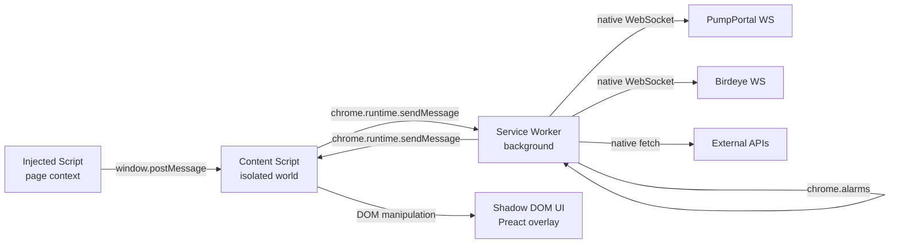
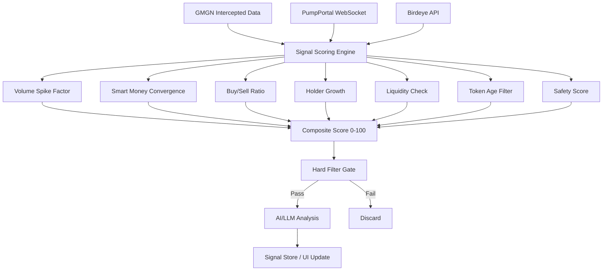

# Technical Specification

# 0. Agent Action Plan

## 0.1 Intent Clarification


### 0.1.1 Core Feature Objective

Based on the prompt, the Blitzy platform understands that the new feature requirement is to **build a GMGN.ai memecoin signal bot as a Chrome Extension** that overlays the GMGN.ai trading platform to provide automated, real-time trading signal generation for Solana memecoin trading. This is a **greenfield project** — the repository is empty (contains only a placeholder `README.md`) and the entire Chrome Extension must be created from scratch.

The core feature requirements are:

- **Chrome Extension Overlay**: Build a Manifest V3 Chrome Extension that injects into `gmgn.ai/*` pages, rendering a fixed sidebar panel with signal data, safety scores, and AI-generated analysis using Shadow DOM isolation and Preact for lightweight rendering
- **GMGN.ai Data Interception**: Capture internal API data that the GMGN frontend already fetches by monkey-patching `window.fetch` and `XMLHttpRequest` within the page context, relaying intercepted responses through `window.postMessage` to the content script and then to the service worker — bypassing Cloudflare restrictions entirely
- **Multi-Source Data Pipeline**: Integrate with Birdeye (token analytics), PumpPortal (new pump.fun token events via WebSocket), Jupiter (price quotes and honeypot simulation), Helius (enhanced transaction parsing), DexScreener (fallback data), RugCheck (token safety reports), and GoPlus Security (contract security checks)
- **7-Factor Signal Scoring Engine**: Implement a composite scoring system (0–100) weighted across volume spike detection, smart money convergence, buy/sell ratio analysis, holder growth tracking, liquidity thresholds, token age filters, and safety score validation — with configurable thresholds for conservative (≥80) and aggressive (≥45) trading modes
- **Smart Money and Whale Tracking**: Detect convergence signals when 3+ qualified smart money wallets enter the same token within a 2-hour window, with position-size context analysis (entries above 80% of historical average indicating conviction)
- **Three-Tier AI/LLM Analysis**: Route token analysis through Groq-powered LLM tiers — `llama-3.1-8b-instant` for routine screening (80% of calls), `llama-3.3-70b-versatile` or `openai/gpt-oss-120b` for detailed analysis (15%), and Claude Sonnet for narrative analysis of high-confidence signals (5%)
- **Real-Time WebSocket Streaming**: Maintain persistent WebSocket connections to PumpPortal (`wss://pumpportal.fun/api/data`) for new token events and Birdeye for price streams, leveraging Chrome 116+ WebSocket keepalive behavior in the service worker
- **Tiered Exit Strategy Engine**: Implement the ladder take-profit strategy (sell 50% at 2×, 25% at 5×, 25% at 10×) with configurable day-trade and swing-trade profiles, plus hard exit triggers for dev wallet selling, smart money position reduction, and volume decline

Implicit requirements detected:

- **Encrypted API Key Storage**: All external API keys (Groq, Birdeye, Helius, RugCheck) must be stored encrypted in the service worker context only, never exposed to content scripts
- **Service Worker Lifecycle Management**: Manifest V3 service workers terminate after ~30 seconds of inactivity; all event listeners must be registered synchronously, state must persist via `chrome.storage.session` (10MB in-memory), and `chrome.alarms` (30-second minimum) must replace `setTimeout`/`setInterval`
- **Rate Limit Orchestration**: Each external API has different rate limits (Birdeye: 15–100 RPS depending on plan, DexScreener: 300 req/min, Jupiter: 1 RPS free tier, GMGN Trading API: 1 call per 5 seconds) requiring a centralized request queue with per-API throttling
- **Pump.fun Graduation Awareness**: Only 0.4%–1.8% of pump.fun tokens graduate to DEXes; the signal engine must account for extreme failure rates and filter for tokens at ≥30% bonding curve progress
- **Token-2022 Extension Risks**: Modern Solana tokens using Token-2022 may have `PermanentDelegate` and `DefaultAccountState: frozen` extensions that introduce novel rug vectors not caught by standard checks

### 0.1.2 Special Instructions and Constraints

The user's research document prescribes specific architectural directives:

- **Data Access Strategy**: Intercept GMGN's internal fetch/XHR calls from the content script as the primary data source; supplement with external APIs for safety, pricing, and new token detection — never attempt to directly call GMGN's restricted API endpoints
- **UI Rendering**: Use **Shadow DOM** for complete style isolation from GMGN's CSS; render with **Preact (3KB)** instead of React (40KB+); position as a fixed sidebar panel (`position: fixed; right: 0; width: 350px; z-index: 2147483647`)
- **Build Tooling**: Use **Vite + WXT (WebExtension Toolkit)** as the build framework; WXT 0.20.x is the v1.0 release candidate and the recommended framework for browser extension development
- **State Management**: Use **Zustand** with a `chrome.storage` sync adapter; leverage `zustand/vanilla` for the service worker (non-React context) and Zustand hooks via `preact/compat` in the UI layer
- **DOM Observation**: Use `MutationObserver` on the narrowest possible subtree with 250ms debouncing to detect new token cards appearing on GMGN pages
- **WebSocket Keepalive**: Implement a 20-second keepalive ping for all WebSocket connections; for non-latency-critical data, `chrome.alarms` polling every 30–60 seconds is the safest fallback
- **Minimum Chrome Version**: Target Chrome 116+ (when WebSocket activity began extending service worker lifetime)
- **Cost Target**: The total monthly API cost should be approximately $150–250 (Birdeye Starter $99/mo + Helius Developer $49/mo + LLM costs $5–15/mo), with core monitoring available for free
- **LLM Cost Optimization**: Cache LLM responses in `chrome.storage.local` with 5-minute TTL; use Groq prompt caching (50% discount on cached input); the 80/15/5 tier split reduces costs by ~60%

User Example — Recommended API Stack:
> "The optimal cost-performance combination is: Birdeye Starter ($99/mo) for comprehensive token analytics + PumpPortal (free) for new token detection + Jupiter (free tier) for price quotes and honeypot simulation + Helius Developer ($49/mo) for enhanced transaction parsing and webhooks + DexScreener (free) as a fallback data source. Total: ~$148/mo for a production-grade data pipeline."

User Example — Signal Scoring Thresholds:
> "≥80 composite score: High-confidence signal (conservative mode). ≥45 composite score: Moderate signal (aggressive mode). Entry prevention (hard filters): Bundled launch with >10% sniper supply, mint authority active, no LP lock, liquidity <$3K, top 10 holders >50%."

User Example — Exit Strategy:
> "The ladder strategy: Sell 50% at 2×, 25% at 5×, 25% at 10×, let remainder ride with trailing stop. Day-trade TP/SL: +15%/+30%/+60%, SL -12%. Swing trade: +40%/+100%/+200%/+500%, SL -18%."

### 0.1.3 Technical Interpretation

These feature requirements translate to the following technical implementation strategy:

- To **build the Chrome Extension foundation**, we will create a WXT-based project with Preact integration, configuring `wxt.config.ts` for Manifest V3 with host permissions for `gmgn.ai/*` and all external API domains, a content script targeting `gmgn.ai/*` pages at `document_idle`, and a background service worker
- To **intercept GMGN's internal API data**, we will create an injected page-context script that monkey-patches `window.fetch` and `XMLHttpRequest.prototype.open/send`, capturing responses matching GMGN API patterns (e.g., `/defi/quotation/v1/rank/`, `/api/v1/token/`), then relay parsed data to the content script via `window.postMessage` with origin validation
- To **render the signal overlay**, we will create a Preact-based sidebar component tree rendered inside a Shadow DOM container attached to the GMGN page, using Zustand stores for reactive state with selectors for signal data, token safety, and AI analysis results
- To **manage external API integrations**, we will create a unified API client layer in the service worker with per-provider rate limiting (token bucket pattern), response caching, error retry with exponential backoff, and encrypted API key retrieval from `chrome.storage.local`
- To **implement the signal scoring engine**, we will create a composable scoring pipeline where each of the 7 factors (volume spike, smart money convergence, buy/sell ratio, holder growth, liquidity, token age, safety score) is an independent scorer module producing a weighted sub-score, aggregated into a composite 0–100 score with configurable weight profiles
- To **enable real-time streaming**, we will establish WebSocket connections in the service worker (Chrome 116+ keepalive) to PumpPortal for new token events and Birdeye for price streams, with automatic reconnection, 20-second keepalive pings, and fallback to `chrome.alarms`-based polling
- To **integrate AI/LLM analysis**, we will create a three-tier LLM router in the service worker that dispatches token analysis requests to Groq's API (`llama-3.1-8b-instant` → `llama-3.3-70b-versatile` → Claude Sonnet) based on initial screening score, using structured JSON output for consistent parsing, with 5-minute TTL caching in `chrome.storage.local`
- To **implement exit signal management**, we will create an active position tracker that monitors held tokens against configurable take-profit ladders and stop-loss thresholds, emitting exit alerts when triggers are hit (dev sell, smart money exit, volume decline, price target reached)


## 0.2 Repository Scope Discovery


### 0.2.1 Comprehensive File Analysis

The repository is a **greenfield project** — it contains only a single placeholder file (`README.md` with content `# quick-repo-6`). There are no existing source files, configuration files, tests, or dependency manifests. All files must be created from scratch.

**Current Repository State:**

| Path | Type | Status |
|------|------|--------|
| `README.md` | File | MODIFY — Replace placeholder with project documentation |

**WXT Project Structure — Complete File Inventory:**

The project follows WXT conventions where `entrypoints/` contains Chrome Extension entry points (background service worker, content scripts, popup) and `src/` contains shared application logic. WXT auto-generates the `manifest.json` from `wxt.config.ts`.

**Root Configuration Files (to be created):**

| File | Purpose |
|------|---------|
| `package.json` | NPM dependency manifest with scripts for `dev`, `build`, `zip`, and `test` |
| `wxt.config.ts` | WXT framework configuration — Preact JSX, host permissions, content script matching |
| `tsconfig.json` | TypeScript compiler options — strict mode, Preact JSX pragma, path aliases |
| `vitest.config.ts` | Vitest test runner configuration for unit and integration tests |
| `.env.example` | Template for API keys: `BIRDEYE_API_KEY`, `HELIUS_API_KEY`, `RUGCHECK_API_KEY`, `GROQ_API_KEY` |
| `.gitignore` | Standard Node.js + WXT ignores (`node_modules/`, `.output/`, `.wxt/`, `dist/`) |
| `tailwind.config.ts` | TailwindCSS configuration scoped for Shadow DOM rendering (optional, if using Tailwind) |

**Entrypoints Directory (WXT convention — `entrypoints/`):**

| File | Purpose |
|------|---------|
| `entrypoints/background.ts` | Service worker — API calls, signal engine orchestration, WebSocket management, alarm-based polling, chrome.storage state persistence |
| `entrypoints/content.ts` | Content script — injects into `gmgn.ai/*`, creates Shadow DOM container, mounts Preact overlay app, bridges messages between page context and service worker |
| `entrypoints/injected.ts` | Page-context script — monkey-patches `window.fetch` and `XMLHttpRequest` to intercept GMGN's internal API responses, posts captured data via `window.postMessage` |
| `entrypoints/popup/index.html` | Popup HTML shell for the extension toolbar popup |
| `entrypoints/popup/App.tsx` | Popup Preact component — quick status view, API key configuration, mode toggle |
| `entrypoints/popup/main.tsx` | Popup entry point — Preact render bootstrap |

**Source — Signal Scoring Engine (`src/signals/`):**

| File | Purpose |
|------|---------|
| `src/signals/scoring-engine.ts` | Composite signal orchestrator — aggregates 7 weighted factor sub-scores into 0–100 composite, applies hard filters, emits BUY/SKIP/EXIT decisions |
| `src/signals/factors/volume-spike.ts` | Detects 3–8× volume increase over 5-minute MA, minimum $200 5m volume and $2,000 1h volume |
| `src/signals/factors/smart-money-convergence.ts` | Detects 3+ qualified smart wallets entering same token within 2-hour window, with position-size context |
| `src/signals/factors/buy-sell-ratio.ts` | Evaluates buy/sell pressure ratio, minimum ≥1.3× for accumulation signal |
| `src/signals/factors/holder-growth.ts` | Tracks organic wallet growth (holders retaining tokens ≥24h), flags bot-like creation patterns |
| `src/signals/factors/liquidity.ts` | Validates minimum liquidity ($3K–$30K for pump.fun), ensures volume is 10× intended position size |
| `src/signals/factors/token-age.ts` | Filters by token age — ≤3h for early accumulation, ≤12h maximum for gem scanning |
| `src/signals/factors/safety-score.ts` | Integrates RugCheck + GoPlus safety data, requires score ≥300 and top holder concentration ≤20% |
| `src/signals/exit-signals.ts` | Monitors active positions for exit triggers — dev sell, smart money exit, volume decline, TP/SL ladder |
| `src/signals/hard-filters.ts` | Binary pass/fail safety gates — bundled launch >10% sniper supply, mint authority active, no LP lock, liquidity <$3K, top 10 holders >50% |
| `src/signals/types.ts` | Type definitions for `SignalScore`, `FactorResult`, `CompositeSignal`, `ExitTrigger`, `TradingMode` |

**Source — External API Clients (`src/api/`):**

| File | Purpose |
|------|---------|
| `src/api/birdeye.ts` | Birdeye REST client — `/defi/price`, `/defi/ohlcv`, `/defi/txs/token`, `/defi/token_overview`, auth via `X-API-KEY` header |
| `src/api/pump-portal.ts` | PumpPortal WebSocket client — `subscribeNewToken`, `subscribeMigration`, `subscribeTokenTrade` events |
| `src/api/jupiter.ts` | Jupiter API client — `/price/v3/` for prices, `/quote` for swap simulation and honeypot detection |
| `src/api/helius.ts` | Helius RPC client — Enhanced Transactions API for parsed wallet activity, webhook management |
| `src/api/dexscreener.ts` | DexScreener REST client — `/dex/tokens/{address}`, `/dex/pairs/{chainId}/{pairAddress}`, no auth |
| `src/api/rugcheck.ts` | RugCheck REST client — `/tokens/{id}/report`, `/tokens/{id}/insiders/graph`, auth via `X-API-KEY` |
| `src/api/goplus.ts` | GoPlus Security client — `/api/v1/solana/token_security`, free tier, returns mint/freeze authority, holder distribution |
| `src/api/groq.ts` | Groq LLM client — chat completions with structured JSON output, three-tier model selection |
| `src/api/rate-limiter.ts` | Per-API token bucket rate limiter — configurable RPS per provider, request queuing with priority |
| `src/api/base-client.ts` | Abstract HTTP client with retry logic, exponential backoff, timeout handling, response caching |
| `src/api/types.ts` | Shared API response types — `BirdeyeTokenData`, `PumpPortalEvent`, `JupiterQuote`, `RugCheckReport`, `GoPlusResult` |

**Source — GMGN Data Interception (`src/gmgn/`):**

| File | Purpose |
|------|---------|
| `src/gmgn/interceptor.ts` | Core fetch/XHR monkey-patch logic — intercepts responses matching GMGN API URL patterns, serializes and posts via `window.postMessage` |
| `src/gmgn/url-patterns.ts` | GMGN internal API URL pattern registry — `/defi/quotation/v1/rank/`, `/api/v1/token/`, `/api/v1/wallet_activity/` |
| `src/gmgn/parsers.ts` | Response parsers for GMGN data structures — trending tokens, token detail, wallet activity, smart money signals |
| `src/gmgn/types.ts` | Type definitions for `GmgnTrendingToken`, `GmgnTokenDetail`, `GmgnWalletActivity`, `GmgnSmartMoneySignal` |

**Source — Smart Money Tracking (`src/tracking/`):**

| File | Purpose |
|------|---------|
| `src/tracking/wallet-tracker.ts` | Manages tracked wallet list, monitors activity via intercepted GMGN data and Helius API |
| `src/tracking/convergence-detector.ts` | Time-windowed convergence detection — fires when 3+ tracked wallets enter same token within configurable window (default 2h) |
| `src/tracking/wallet-classifier.ts` | Classifies wallets by type: Smart Money, KOL, Whale, Sniper, Insider, Developer based on GMGN categorization data |
| `src/tracking/types.ts` | Type definitions for `TrackedWallet`, `WalletClassification`, `ConvergenceEvent`, `PositionSizeContext` |

**Source — Token Safety (`src/safety/`):**

| File | Purpose |
|------|---------|
| `src/safety/checker.ts` | Multi-source safety orchestrator — calls RugCheck + GoPlus concurrently, aggregates results |
| `src/safety/honeypot-detector.ts` | Jupiter-based honeypot simulation — attempts `/quote` for TOKEN→SOL swap, validates sellability |
| `src/safety/lp-analyzer.ts` | LP lock/burn analysis — checks if burn address holds majority of LP tokens |
| `src/safety/types.ts` | Type definitions for `SafetyReport`, `HoneypotResult`, `LPStatus`, `AuthorityStatus` |

**Source — AI/LLM Integration (`src/ai/`):**

| File | Purpose |
|------|---------|
| `src/ai/router.ts` | Three-tier LLM dispatch — routes to Groq `llama-3.1-8b-instant` (80%), `llama-3.3-70b-versatile` (15%), Claude (5%) based on initial score |
| `src/ai/prompts.ts` | Prompt templates for 5 analysis dimensions: on-chain momentum, social velocity, wallet intelligence, liquidity health, narrative fit |
| `src/ai/response-parser.ts` | Parses structured JSON LLM responses into typed `AIAnalysisResult` objects |
| `src/ai/types.ts` | Type definitions for `AIAnalysisResult`, `AnalysisDimension`, `LLMTier`, `PromptTemplate` |

**Source — WebSocket Streaming (`src/streaming/`):**

| File | Purpose |
|------|---------|
| `src/streaming/manager.ts` | WebSocket lifecycle manager — creation, keepalive (20s ping), reconnection with backoff, Chrome 116+ idle reset |
| `src/streaming/pump-portal-stream.ts` | PumpPortal-specific stream handler — subscribes to `subscribeNewToken`, `subscribeTokenTrade`, `subscribeMigration` |
| `src/streaming/birdeye-stream.ts` | Birdeye WebSocket handler — `SUBSCRIBE_PRICE`, `SUBSCRIBE_TXS`, `SUBSCRIBE_TOKEN_NEW_LISTING` |
| `src/streaming/types.ts` | Type definitions for `StreamEvent`, `StreamSubscription`, `ConnectionState`, `ReconnectionConfig` |

**Source — State Management (`src/store/`):**

| File | Purpose |
|------|---------|
| `src/store/signal-store.ts` | Zustand store for active signals — composite scores, factor breakdowns, signal history |
| `src/store/token-store.ts` | Zustand store for token data — price, safety, metadata, smart money activity per token |
| `src/store/settings-store.ts` | Zustand store for user settings — trading mode (conservative/aggressive), TP/SL profiles, API keys, notification preferences |
| `src/store/position-store.ts` | Zustand store for tracked positions — entry price, current price, TP/SL levels, exit alerts |
| `src/store/chrome-storage-adapter.ts` | Zustand middleware for persisting store state to `chrome.storage.local` with serialization/deserialization |
| `src/store/index.ts` | Store exports and initialization — vanilla stores for service worker, hook-based stores for Preact UI |

**Source — UI Components (`src/components/`):**

| File | Purpose |
|------|---------|
| `src/components/App.tsx` | Root Preact component — renders inside Shadow DOM, manages panel visibility toggle |
| `src/components/SignalPanel.tsx` | Main sidebar panel — lists active signals sorted by composite score, filter controls |
| `src/components/TokenCard.tsx` | Individual token signal card — displays score gauge, safety badge, smart money indicators, AI insight summary |
| `src/components/SafetyBadge.tsx` | Safety score visualization — color-coded badge (green/yellow/red) with RugCheck + GoPlus composite |
| `src/components/ScoreGauge.tsx` | Composite score circular gauge — 0–100 with color gradient and factor breakdown tooltip |
| `src/components/AIInsight.tsx` | AI analysis display — shows LLM-generated narrative with confidence level and analysis dimensions |
| `src/components/ExitStrategy.tsx` | Exit signal display — shows active TP/SL ladder, current price position, triggered alerts |
| `src/components/SmartMoneyIndicator.tsx` | Smart money activity indicator — shows wallet count, convergence status, position sizes |
| `src/components/SettingsPanel.tsx` | User configuration panel — API key entry, trading mode toggle, weight customization, notification preferences |
| `src/components/NewTokenFeed.tsx` | Real-time new token feed from PumpPortal — shows newly created tokens with initial safety screening |
| `src/components/styles.css` | Shadow DOM scoped stylesheet — all component styles isolated from GMGN page CSS |

**Source — Utilities (`src/utils/`):**

| File | Purpose |
|------|---------|
| `src/utils/crypto.ts` | AES-GCM encryption/decryption for API keys using Web Crypto API |
| `src/utils/messaging.ts` | Chrome runtime message type-safe helpers — `sendMessage`, `onMessage` with discriminated union message types |
| `src/utils/cache.ts` | TTL-based cache over `chrome.storage.local` — get/set with expiration, automatic cleanup |
| `src/utils/logger.ts` | Structured logging utility — log levels, context tags, optional forwarding to service worker |
| `src/utils/config.ts` | Application constants — API base URLs, default scoring weights, rate limit configs, version info |
| `src/utils/formatting.ts` | Number formatting helpers — price display, market cap abbreviation, percentage formatting |

**Tests (`tests/`):**

| File | Purpose |
|------|---------|
| `tests/unit/signals/scoring-engine.test.ts` | Tests composite scoring with various factor combinations |
| `tests/unit/signals/factors/volume-spike.test.ts` | Tests volume spike detection against 5m MA |
| `tests/unit/signals/factors/smart-money-convergence.test.ts` | Tests convergence window detection logic |
| `tests/unit/signals/factors/buy-sell-ratio.test.ts` | Tests ratio threshold validation |
| `tests/unit/signals/factors/holder-growth.test.ts` | Tests organic vs bot-like growth classification |
| `tests/unit/signals/factors/liquidity.test.ts` | Tests liquidity threshold validation |
| `tests/unit/signals/factors/token-age.test.ts` | Tests token age filter boundaries |
| `tests/unit/signals/factors/safety-score.test.ts` | Tests multi-source safety aggregation |
| `tests/unit/signals/hard-filters.test.ts` | Tests binary pass/fail gate conditions |
| `tests/unit/signals/exit-signals.test.ts` | Tests exit trigger detection and TP/SL ladder |
| `tests/unit/api/rate-limiter.test.ts` | Tests token bucket rate limiting per API |
| `tests/unit/api/birdeye.test.ts` | Tests Birdeye API response parsing and error handling |
| `tests/unit/api/rugcheck.test.ts` | Tests RugCheck report parsing |
| `tests/unit/api/goplus.test.ts` | Tests GoPlus security data parsing |
| `tests/unit/api/jupiter.test.ts` | Tests Jupiter quote parsing and honeypot detection |
| `tests/unit/safety/checker.test.ts` | Tests concurrent multi-source safety check orchestration |
| `tests/unit/safety/honeypot-detector.test.ts` | Tests honeypot simulation result interpretation |
| `tests/unit/ai/router.test.ts` | Tests three-tier LLM routing logic |
| `tests/unit/ai/response-parser.test.ts` | Tests structured JSON LLM response parsing |
| `tests/unit/gmgn/interceptor.test.ts` | Tests fetch/XHR interception and postMessage relay |
| `tests/unit/gmgn/parsers.test.ts` | Tests GMGN response data extraction |
| `tests/unit/tracking/convergence-detector.test.ts` | Tests time-windowed multi-wallet convergence |
| `tests/unit/store/chrome-storage-adapter.test.ts` | Tests Zustand-to-chrome.storage persistence |
| `tests/unit/utils/crypto.test.ts` | Tests AES-GCM encrypt/decrypt round-trip |
| `tests/unit/utils/cache.test.ts` | Tests TTL expiration and cleanup |
| `tests/integration/signal-pipeline.test.ts` | End-to-end test: token data → safety check → scoring → AI analysis → signal output |
| `tests/integration/api-integration.test.ts` | Tests API client integration with rate limiter and cache |
| `tests/integration/websocket-stream.test.ts` | Tests WebSocket manager reconnection and keepalive logic |

**Documentation (`docs/`):**

| File | Purpose |
|------|---------|
| `docs/architecture.md` | High-level architecture diagram and component descriptions |
| `docs/api-integration.md` | External API reference — endpoints, auth, rate limits, response schemas |
| `docs/signal-engine.md` | Signal scoring algorithm details — factor weights, thresholds, calibration |
| `docs/setup-guide.md` | Developer setup instructions — API key configuration, build, and sideload |

**Static Assets (`public/`):**

| File | Purpose |
|------|---------|
| `public/icon-16.png` | Extension icon (16×16) for favicon contexts |
| `public/icon-48.png` | Extension icon (48×48) for extension management page |
| `public/icon-128.png` | Extension icon (128×128) for Chrome Web Store |

### 0.2.2 Web Search Research Conducted

The following web research was conducted to validate technology choices and API capabilities:

- **WXT (WebExtension Toolkit)**: Confirmed latest stable version is **0.20.17** on npm. WXT is a framework for building browser extensions with TypeScript, React/Preact/Vue support, hot module replacement during development, and auto-generation of Manifest V3 manifests. It manages its own internal Vite version.
- **Preact**: Confirmed latest stable version is **10.29.0** on npm. Preact provides a 3KB alternative to React with the same modern API. `preact/compat` enables use of React-compatible libraries like Zustand hooks.
- **Zustand**: Confirmed latest stable version is **5.0.11** on npm. Zustand 5.x supports `zustand/vanilla` for non-React contexts (service workers) and `zustand/react` (or via `preact/compat`) for UI components.
- **TypeScript**: Confirmed latest stable version is **5.9.3** on npm. TypeScript 6.0 is in RC stage but not yet stable. The project will use TypeScript 5.9.x for stability.
- **Vite**: Confirmed Vite 8.0.0 is available, requiring Node.js ≥20.19. However, WXT manages its own Vite version internally, so the project relies on WXT's bundled Vite.
- **Groq API**: Confirmed available models include `llama-3.1-8b-instant` (fast screening, JSON mode supported), `llama-3.3-70b-versatile` (detailed analysis), and enterprise models. Structured JSON output via `response_format: { type: 'json_object' }`.
- **RugCheck API**: Confirmed public REST API at `api.rugcheck.xyz/swagger/index.html` with endpoints including `GET /tokens/{id}/report`, `GET /tokens/{id}/insiders/graph`, `GET /wallets/risk-rating/{chain}/{address}`, and stats endpoints for new/trending/verified tokens. Authentication via Bearer token or `X-API-KEY` header.
- **GoPlus Security**: Confirmed Solana support with `GET /api/v1/solana/token_security?contract_addresses={address}` returning `is_mintable`, `is_freezable`, holder distribution, LP lock status.
- **PumpPortal WebSocket**: Confirmed free WebSocket at `wss://pumpportal.fun/api/data` with `subscribeNewToken`, `subscribeMigration`, `subscribeTokenTrade`, `subscribeAccountTrade` events. Single connection, multiple subscriptions.
- **Chrome Extension Manifest V3**: Confirmed service worker WebSocket keepalive behavior since Chrome 116 — sending or receiving messages resets the 30-second idle timer.

### 0.2.3 New File Requirements

Since this is a greenfield project, **all files are new**. The complete file creation manifest contains **87 source files** organized as follows:

**New Source Files (57 files):**
- `src/signals/**/*.ts` — 11 files (scoring engine, 7 factors, exit signals, hard filters, types)
- `src/api/**/*.ts` — 11 files (7 API clients, rate limiter, base client, types)
- `src/gmgn/**/*.ts` — 4 files (interceptor, URL patterns, parsers, types)
- `src/tracking/**/*.ts` — 4 files (wallet tracker, convergence detector, classifier, types)
- `src/safety/**/*.ts` — 4 files (checker, honeypot detector, LP analyzer, types)
- `src/ai/**/*.ts` — 4 files (router, prompts, response parser, types)
- `src/streaming/**/*.ts` — 4 files (manager, PumpPortal stream, Birdeye stream, types)
- `src/store/**/*.ts` — 6 files (signal store, token store, settings store, position store, adapter, index)
- `src/components/**/*.tsx` — 11 files (App, SignalPanel, TokenCard, SafetyBadge, ScoreGauge, AIInsight, ExitStrategy, SmartMoneyIndicator, SettingsPanel, NewTokenFeed, styles)
- `src/utils/**/*.ts` — 6 files (crypto, messaging, cache, logger, config, formatting)

**New Entrypoint Files (6 files):**
- `entrypoints/background.ts`, `entrypoints/content.ts`, `entrypoints/injected.ts`
- `entrypoints/popup/index.html`, `entrypoints/popup/App.tsx`, `entrypoints/popup/main.tsx`

**New Test Files (28 files):**
- `tests/unit/signals/**/*.test.ts` — 10 test files
- `tests/unit/api/**/*.test.ts` — 5 test files
- `tests/unit/safety/**/*.test.ts` — 2 test files
- `tests/unit/ai/**/*.test.ts` — 2 test files
- `tests/unit/gmgn/**/*.test.ts` — 2 test files
- `tests/unit/tracking/**/*.test.ts` — 1 test file
- `tests/unit/store/**/*.test.ts` — 1 test file
- `tests/unit/utils/**/*.test.ts` — 2 test files
- `tests/integration/**/*.test.ts` — 3 test files

**New Configuration Files (6 files):**
- `package.json`, `wxt.config.ts`, `tsconfig.json`, `vitest.config.ts`, `.env.example`, `.gitignore`

**New Documentation Files (4 files):**
- `docs/architecture.md`, `docs/api-integration.md`, `docs/signal-engine.md`, `docs/setup-guide.md`

**New Static Assets (3 files):**
- `public/icon-16.png`, `public/icon-48.png`, `public/icon-128.png`

**Modified Files (1 file):**
- `README.md` — Replace placeholder content with comprehensive project documentation

**Total: 105 files** (104 new + 1 modified)


## 0.3 Dependency Inventory


### 0.3.1 Private and Public Packages

Since this is a greenfield project with no existing `package.json`, all dependencies must be added fresh. The following tables list every package required, organized by registry, with exact verified versions.

**Core Runtime Dependencies (npm — production):**

| Registry | Package | Version | Purpose |
|----------|---------|---------|---------|
| npm | `wxt` | 0.20.17 | WebExtension Toolkit — Manifest V3 build framework with HMR, auto-manifest generation, and entrypoint management |
| npm | `preact` | 10.29.0 | Lightweight 3KB React alternative — renders overlay UI inside Shadow DOM |
| npm | `preact/compat` | 10.29.0 | React compatibility layer — enables use of React-compatible libraries (Zustand hooks) with Preact |
| npm | `zustand` | 5.0.11 | State management — `zustand/vanilla` for service worker stores, Zustand hooks for Preact UI via `preact/compat` |

**External API & Utility Dependencies (npm — production):**

| Registry | Package | Version | Purpose |
|----------|---------|---------|---------|
| npm | `groq-sdk` | 0.18.0 | Official Groq API client — LLM inference calls with structured JSON output |

Note: No additional HTTP client library is required. All external API calls (Birdeye, RugCheck, GoPlus, Jupiter, DexScreener, Helius) use the native `fetch()` API available in the service worker context. WebSocket connections use the native `WebSocket` API. Encryption uses the native `Web Crypto API`.

**Development Dependencies (npm — devDependencies):**

| Registry | Package | Version | Purpose |
|----------|---------|---------|---------|
| npm | `typescript` | 5.9.3 | TypeScript compiler — strict mode, Preact JSX pragma support |
| npm | `@preact/preset-vite` | 2.10.3 | Preact Vite plugin — JSX transformation, alias configuration for `preact/compat` |
| npm | `vitest` | 4.1.0 | Test framework — Vite-native test runner with built-in coverage, mock support, and TypeScript integration |
| npm | `happy-dom` | latest | DOM environment for Vitest — lightweight DOM implementation for component testing |
| npm | `@testing-library/preact` | 3.2.4 | Preact testing utilities — render, screen, fireEvent for component unit tests |
| npm | `@types/chrome` | latest | Chrome Extension API type definitions — typed access to `chrome.storage`, `chrome.runtime`, `chrome.alarms`, `chrome.offscreen` |

**External API Services (not npm packages — API keys required):**

| Provider | Base URL | Auth Method | Plan / Cost | Purpose |
|----------|----------|-------------|-------------|---------|
| Birdeye | `https://public-api.birdeye.so` | `X-API-KEY` header | Starter $99/mo | Token analytics — price, OHLCV, transactions, top holders, WebSocket streams |
| Helius | `https://api.helius.xyz` | API key in URL | Developer $49/mo | Enhanced Solana RPC — parsed transactions, webhooks, token metadata |
| Groq | `https://api.groq.com` | `Authorization: Bearer` | Free tier (tokens/day limited) | LLM inference — `llama-3.1-8b-instant`, `llama-3.3-70b-versatile` |
| RugCheck | `https://api.rugcheck.xyz` | `X-API-KEY` header | Free | Token safety reports, insider detection, risk scoring |
| GoPlus | `https://api.gopluslabs.io` | None (free) | Free Beta | Solana token security — mint/freeze authority, holder distribution |
| Jupiter | `https://price.jup.ag` | None (free) | Free tier 1 RPS | Price quotes, swap simulation for honeypot detection |
| DexScreener | `https://api.dexscreener.com` | None (free) | Free | Fallback token data — price, volume, liquidity, pair info |
| PumpPortal | `wss://pumpportal.fun/api/data` | None (free) | Free | WebSocket — new pump.fun token events, trade events, migration events |
| Anthropic (Claude) | `https://api.anthropic.com` | `x-api-key` header | Pay-per-use | Narrative analysis for top-5% highest-confidence signals |

### 0.3.2 Dependency Updates

Since this is a greenfield project with no existing code, there are no dependency migrations, import refactoring, or external reference updates required. All imports will be established fresh.

**Import Conventions to Establish:**

All source files will follow these import patterns:

- Preact imports: `import { h, render } from 'preact'` and `import { useState, useEffect } from 'preact/hooks'`
- Zustand imports (UI): `import { useStore } from '../store/signal-store'` (via `preact/compat` aliasing)
- Zustand imports (service worker): `import { createStore } from 'zustand/vanilla'`
- Chrome API imports: Accessed globally via `chrome.storage`, `chrome.runtime`, `chrome.alarms` (types from `@types/chrome`)
- Internal module imports: Relative paths with TypeScript path aliases configured in `tsconfig.json` (e.g., `@/signals/`, `@/api/`, `@/store/`)

**Path Alias Configuration (tsconfig.json):**

```json
{
  "compilerOptions": {
    "paths": {
      "@/*": ["./src/*"],
      "@/signals/*": ["./src/signals/*"],
      "@/api/*": ["./src/api/*"],
      "@/store/*": ["./src/store/*"]
    }
  }
}
```

**Build Output Configuration:**

WXT produces the following output structure:
- `.output/chrome-mv3/` — Production Chrome Extension build
- `.wxt/` — WXT internal build cache
- `node_modules/` — NPM dependency tree

**Configuration Files to Create:**

| File | Key Settings |
|------|-------------|
| `wxt.config.ts` | `srcDir: '.'`, `modules: []`, manifest configuration with `host_permissions`, `permissions: ['storage', 'alarms', 'offscreen', 'activeTab']`, Preact JSX via `@preact/preset-vite` |
| `tsconfig.json` | `strict: true`, `jsx: 'react-jsx'`, `jsxImportSource: 'preact'`, `paths` aliases, `target: 'esnext'`, `module: 'esnext'` |
| `vitest.config.ts` | `environment: 'happy-dom'`, `globals: true`, `include: ['tests/**/*.test.ts']`, `coverage.provider: 'v8'` |
| `.env.example` | `BIRDEYE_API_KEY=`, `HELIUS_API_KEY=`, `RUGCHECK_API_KEY=`, `GROQ_API_KEY=`, `ANTHROPIC_API_KEY=` |


## 0.4 Integration Analysis


### 0.4.1 Existing Code Touchpoints

Since the repository is a greenfield scaffold (containing only a placeholder `README.md`), there are no existing files requiring direct modification beyond the README itself. All integration points described below represent **inter-component wiring** that must be established as the project is built from scratch.

**Single Existing File Modification:**

- `README.md` — Replace the placeholder content (`# quick-repo-6`) with comprehensive project documentation covering installation, configuration, development workflow, API key setup, and build/deployment instructions

### 0.4.2 Chrome Extension Message Bus Architecture

The Chrome Extension's three-layer architecture (page-context script → content script → service worker) requires a carefully designed message bus. All inter-layer communication flows through typed message channels.

**Layer-to-Layer Communication Map:**



**Direct integration wiring required:**

- `entrypoints/injected.ts` → `entrypoints/content.ts`: The injected script captures GMGN API responses by monkey-patching `window.fetch` and posts them via `window.postMessage` with a discriminated `type` field (e.g., `{ source: 'gmgn-signal-bot', type: 'GMGN_API_RESPONSE', payload: ... }`). The content script listens with `window.addEventListener('message', handler)` and validates `event.origin === 'https://gmgn.ai'`
- `entrypoints/content.ts` → `entrypoints/background.ts`: The content script forwards intercepted GMGN data and UI actions to the service worker via `chrome.runtime.sendMessage({ type: 'TOKEN_DATA', payload })`. The service worker registers a synchronous `chrome.runtime.onMessage.addListener` at the top level (mandatory for MV3 lifecycle)
- `entrypoints/background.ts` → `entrypoints/content.ts`: The service worker pushes signal updates, safety results, and AI analysis back to the content script via `chrome.runtime.sendMessage` or `chrome.tabs.sendMessage(tabId, message)`. The content script updates Zustand stores, triggering Preact re-renders in the Shadow DOM overlay
- `entrypoints/background.ts` → External APIs: All outbound API calls (`fetch()` to Birdeye, RugCheck, GoPlus, Jupiter, DexScreener, Helius, Groq) are made exclusively from the service worker using `host_permissions` declared in the manifest

### 0.4.3 Signal Pipeline Integration Points

The signal scoring engine is the central integration hub, consuming data from multiple sources and producing composite scores that drive the UI.

**Data Flow — Token Analysis Pipeline:**



**Integration touchpoints in the signal pipeline:**

- `src/signals/scoring-engine.ts` ← `src/gmgn/parsers.ts`: Receives parsed GMGN token data (trending tokens, token detail, wallet activity) as `GmgnTokenDetail` objects
- `src/signals/scoring-engine.ts` ← `src/streaming/pump-portal-stream.ts`: Receives new token events from PumpPortal WebSocket as `PumpPortalNewTokenEvent` objects
- `src/signals/scoring-engine.ts` ← `src/api/birdeye.ts`: Enriches token data with Birdeye analytics (OHLCV, top holders, transaction history) via direct API calls
- `src/signals/factors/safety-score.ts` ← `src/safety/checker.ts`: Calls the multi-source safety orchestrator which concurrently queries RugCheck and GoPlus
- `src/signals/factors/safety-score.ts` ← `src/safety/honeypot-detector.ts`: Validates token sellability via Jupiter quote simulation
- `src/signals/factors/smart-money-convergence.ts` ← `src/tracking/convergence-detector.ts`: Receives convergence events when 3+ qualified wallets enter the same token within the time window
- `src/signals/scoring-engine.ts` → `src/ai/router.ts`: Tokens passing initial scoring threshold are forwarded to the three-tier LLM router for AI-enhanced analysis
- `src/signals/scoring-engine.ts` → `src/store/signal-store.ts`: Final composite scores and signal decisions are written to the Zustand signal store
- `src/signals/exit-signals.ts` ← `src/store/position-store.ts`: The exit signal monitor reads active positions and monitors for exit trigger conditions

### 0.4.4 State Management Integration

Zustand stores serve as the central state layer binding the service worker analysis engine to the Preact UI layer.

**Store ↔ Component Bindings:**

| Zustand Store | Writer (Producer) | Reader (Consumer) | Persistence |
|---------------|-------------------|--------------------|----|
| `signal-store` | `scoring-engine.ts`, `exit-signals.ts` | `SignalPanel.tsx`, `TokenCard.tsx`, `ScoreGauge.tsx` | `chrome.storage.local` |
| `token-store` | `gmgn/parsers.ts`, `birdeye.ts`, `pump-portal-stream.ts` | `TokenCard.tsx`, `SafetyBadge.tsx`, `NewTokenFeed.tsx` | `chrome.storage.local` |
| `settings-store` | `SettingsPanel.tsx` (user input) | `scoring-engine.ts` (weight config), `ai/router.ts` (tier thresholds) | `chrome.storage.sync` |
| `position-store` | `scoring-engine.ts` (entry), `exit-signals.ts` (exit) | `ExitStrategy.tsx`, `SignalPanel.tsx` | `chrome.storage.local` |

**Cross-context state synchronization:**

- The service worker creates Zustand stores using `zustand/vanilla` (no React/Preact dependency) and persists to `chrome.storage.local` via the `chrome-storage-adapter.ts` middleware
- The content script reads store snapshots from `chrome.storage.local` and creates Preact-compatible Zustand hooks for the UI layer
- State changes in the service worker propagate to the content script via `chrome.storage.onChanged` listeners, which trigger Zustand store updates and Preact re-renders

### 0.4.5 WebSocket Stream Integration

Real-time WebSocket connections are managed in the service worker and feed data into the signal pipeline.

**WebSocket ↔ Pipeline Integration:**

- `src/streaming/pump-portal-stream.ts` → `entrypoints/background.ts`: PumpPortal new token events (`subscribeNewToken`) are forwarded to the scoring engine for immediate initial screening; trade events (`subscribeTokenTrade`) update the `token-store` for active tokens
- `src/streaming/birdeye-stream.ts` → `entrypoints/background.ts`: Birdeye price subscription events (`SUBSCRIBE_PRICE`) update token price data in `token-store`; large trade events (`SUBSCRIBE_LARGE_TRADE_TXS`) feed into the volume spike and smart money convergence factors
- `src/streaming/manager.ts` ← `entrypoints/background.ts`: The service worker's `chrome.alarms` listener triggers keepalive pings (every 20 seconds) and reconnection checks for all active WebSocket connections

### 0.4.6 External API Integration Map

Each external API integrates at specific points in the analysis pipeline. The following maps every API to its consuming module:

| External API | Consuming Module(s) | Trigger | Rate Limit Handling |
|-------------|---------------------|---------|---------------------|
| Birdeye REST | `src/api/birdeye.ts` → `scoring-engine.ts`, `token-store` | New token detection, token detail enrichment | Token bucket 15 RPS (Starter plan) via `rate-limiter.ts` |
| PumpPortal WS | `src/streaming/pump-portal-stream.ts` → `scoring-engine.ts` | Persistent connection, event-driven | Single connection, multi-subscription |
| Jupiter | `src/api/jupiter.ts` → `honeypot-detector.ts` | Safety check for every new token | Token bucket 1 RPS (free tier) via `rate-limiter.ts` |
| Helius | `src/api/helius.ts` → `wallet-tracker.ts`, `convergence-detector.ts` | Smart money wallet activity monitoring | Token bucket 10 RPS (Developer plan) via `rate-limiter.ts` |
| DexScreener | `src/api/dexscreener.ts` → `token-store` | Fallback when Birdeye rate limit hit | Token bucket 5 RPS (300/min) via `rate-limiter.ts` |
| RugCheck | `src/api/rugcheck.ts` → `checker.ts` → `safety-score.ts` | Every new token safety analysis | Best-effort, no documented strict limit |
| GoPlus | `src/api/goplus.ts` → `checker.ts` → `safety-score.ts` | Concurrent with RugCheck for every new token | Best-effort, free tier |
| Groq LLM | `src/api/groq.ts` → `ai/router.ts` | Tokens passing initial scoring threshold | Per-model RPM limits, managed by `rate-limiter.ts` |
| Anthropic Claude | `src/api/groq.ts` (via Anthropic SDK) → `ai/router.ts` | Top 5% highest-confidence signals only | Per-model RPM limits, managed by `rate-limiter.ts` |


## 0.5 Technical Implementation


### 0.5.1 File-by-File Execution Plan

Every file listed below MUST be created or modified. Files are organized into execution groups reflecting their dependency order — foundational infrastructure first, then core logic, then UI, then tests and documentation.

**Group 1 — Project Scaffold and Configuration:**

- CREATE: `package.json` — Define project metadata, scripts (`dev`, `build`, `zip`, `test`, `typecheck`), production dependencies (`wxt`, `preact`, `zustand`, `groq-sdk`), and devDependencies (`typescript`, `@preact/preset-vite`, `vitest`, `happy-dom`, `@testing-library/preact`, `@types/chrome`)
- CREATE: `wxt.config.ts` — Configure WXT framework with Preact support via `@preact/preset-vite` plugin, define manifest fields including `permissions: ['storage', 'alarms', 'offscreen', 'activeTab']`, `host_permissions` for `gmgn.ai/*` and all external API domains, content script matching `https://gmgn.ai/*` at `document_idle`, `minimum_chrome_version: '116'`
- CREATE: `tsconfig.json` — Set `strict: true`, `jsx: 'react-jsx'`, `jsxImportSource: 'preact'`, path aliases (`@/*` → `./src/*`), target `esnext`, module `esnext`
- CREATE: `vitest.config.ts` — Configure `environment: 'happy-dom'`, `globals: true`, test include patterns, V8 coverage provider
- CREATE: `.env.example` — Template for `BIRDEYE_API_KEY`, `HELIUS_API_KEY`, `RUGCHECK_API_KEY`, `GROQ_API_KEY`, `ANTHROPIC_API_KEY`
- CREATE: `.gitignore` — Standard Node.js ignores plus `.output/`, `.wxt/`, `dist/`, `.env`
- MODIFY: `README.md` — Replace placeholder with full project documentation

**Group 2 — Chrome Extension Entrypoints:**

- CREATE: `entrypoints/background.ts` — Service worker entry point; register all `chrome.runtime.onMessage`, `chrome.alarms.onAlarm`, and `chrome.storage.onChanged` listeners synchronously at the top level; initialize vanilla Zustand stores; instantiate the signal scoring engine, WebSocket streaming manager, and API rate limiter; handle keepalive alarms and periodic polling
- CREATE: `entrypoints/content.ts` — Content script entry point; inject the page-context script (`injected.ts`) into the GMGN page via a `<script>` tag; create a Shadow DOM host element (`<div id="gmgn-signal-bot">`) with `position: fixed; right: 0; top: 0; width: 350px; height: 100vh; z-index: 2147483647`; mount Preact `<App />` inside the Shadow DOM; set up `MutationObserver` with 250ms debounce on GMGN's token list container; bridge `window.postMessage` ↔ `chrome.runtime.sendMessage`
- CREATE: `entrypoints/injected.ts` — Page-context script; monkey-patch `window.fetch` to intercept GMGN API responses matching URL patterns in `src/gmgn/url-patterns.ts`; monkey-patch `XMLHttpRequest.prototype.open` and `send` as a fallback; post intercepted response data via `window.postMessage({ source: 'gmgn-signal-bot', ... })`; preserve original fetch/XHR behavior transparently
- CREATE: `entrypoints/popup/index.html` — Popup shell HTML with `<div id="app">` root element
- CREATE: `entrypoints/popup/App.tsx` — Popup Preact component; displays connection status (WebSocket health), active signal count, current trading mode toggle (conservative/aggressive), and a link to open the settings panel
- CREATE: `entrypoints/popup/main.tsx` — Popup bootstrap; imports Preact `render` and mounts `<App />` into `#app`

**Group 3 — GMGN Data Interception Layer:**

- CREATE: `src/gmgn/interceptor.ts` — Core interception logic; wraps the original `window.fetch` with a proxy that clones responses matching GMGN API URL patterns, reads the cloned response body as JSON, and dispatches via `window.postMessage`; handles both `Response.json()` and streaming responses
- CREATE: `src/gmgn/url-patterns.ts` — Regex registry for GMGN internal API routes: `/defi/quotation/v1/rank/{chain}/swaps/`, `/api/v1/token/`, `/api/v1/wallet_activity/`, `/api/v1/smartmoney/`, `/api/v1/token_holders/`; exports a `matchesGmgnApi(url: string): string | null` function returning the matched pattern type
- CREATE: `src/gmgn/parsers.ts` — Response-to-model transformers; parses raw GMGN JSON into typed objects: `parseTrendingTokens()`, `parseTokenDetail()`, `parseWalletActivity()`, `parseSmartMoneySignals()`; normalizes field names and handles missing/null fields defensively
- CREATE: `src/gmgn/types.ts` — TypeScript interfaces: `GmgnTrendingToken`, `GmgnTokenDetail` (price, market cap, volume, liquidity, holders, smart money activity, dev wallet status, rug probability), `GmgnWalletActivity`, `GmgnSmartMoneySignal`

**Group 4 — External API Client Layer:**

- CREATE: `src/api/base-client.ts` — Abstract HTTP client; implements `fetch()` wrapper with configurable timeout (default 10s), retry with exponential backoff (3 attempts, 1s/2s/4s), response caching via `src/utils/cache.ts`, and error classification (rate-limited, auth-failed, server-error, timeout)
- CREATE: `src/api/rate-limiter.ts` — Token bucket rate limiter; maintains per-provider buckets (Birdeye: 15 tokens/s, Jupiter: 1 token/s, DexScreener: 5 tokens/s, Helius: 10 tokens/s); queues requests when bucket is empty; priority support for safety-critical checks
- CREATE: `src/api/birdeye.ts` — Birdeye REST client; methods: `getTokenPrice(mint)`, `getOHLCV(mint, interval)`, `getTokenTransactions(mint)`, `getTokenOverview(mint)`, `getTopHolders(mint)`; all requests include `X-API-KEY` header and `chain=solana` parameter
- CREATE: `src/api/pump-portal.ts` — PumpPortal WebSocket client; connects to `wss://pumpportal.fun/api/data`; subscribes to `subscribeNewToken`, `subscribeTokenTrade`, `subscribeMigration`; emits typed events via callback; single connection with multiplexed subscriptions per PumpPortal guidelines
- CREATE: `src/api/jupiter.ts` — Jupiter API client; methods: `getPrice(mint)` via `/price/v3/`, `getQuote(inputMint, outputMint, amount)` for swap simulation and honeypot detection; handles `ExactIn` mode for sell simulation
- CREATE: `src/api/helius.ts` — Helius RPC client; methods: `getEnhancedTransaction(signature)`, `getTokenMetadata(mint)`, `parseTransaction(signature)` with program-aware parsing (Raydium, Jupiter, Pump.fun); configured with API key in URL path
- CREATE: `src/api/dexscreener.ts` — DexScreener REST client; methods: `getTokenPairs(tokenAddress)`, `getPairByAddress(chainId, pairAddress)`; no authentication; used as fallback when Birdeye rate limit is hit
- CREATE: `src/api/rugcheck.ts` — RugCheck REST client; methods: `getTokenReport(mint)` via `/tokens/{id}/report`, `getInsiderGraph(mint)` via `/tokens/{id}/insiders/graph`; auth via `X-API-KEY` header
- CREATE: `src/api/goplus.ts` — GoPlus Security client; method: `getTokenSecurity(address)` via `/api/v1/solana/token_security`; returns parsed `is_mintable`, `is_freezable`, LP locked status, holder concentration
- CREATE: `src/api/groq.ts` — Groq LLM client; method: `analyze(prompt, model, options)` with `response_format: { type: 'json_object' }`; supports model selection from `llama-3.1-8b-instant`, `llama-3.3-70b-versatile`, and Claude via Anthropic API fallback
- CREATE: `src/api/types.ts` — Shared response interfaces: `BirdeyeTokenData`, `BirdeyeOHLCV`, `PumpPortalEvent`, `PumpPortalNewToken`, `JupiterQuote`, `JupiterPrice`, `HeliusParsedTx`, `RugCheckReport`, `GoPlusResult`, `DexScreenerPair`

**Group 5 — Signal Scoring Engine:**

- CREATE: `src/signals/types.ts` — Core signal type definitions: `FactorResult { name, score: 0-100, weight, metadata }`, `CompositeSignal { composite: 0-100, factors: FactorResult[], decision: 'BUY'|'SKIP'|'EXIT', confidence }`, `TradingMode { 'conservative'|'aggressive' }`, `ExitTrigger`, `HardFilterResult`
- CREATE: `src/signals/scoring-engine.ts` — Composite orchestrator; accepts a `TokenAnalysisInput` (GMGN data + API enrichment); runs all 7 factor modules in parallel via `Promise.allSettled`; computes weighted sum with configurable weights from `settings-store`; applies hard filters from `hard-filters.ts`; returns `CompositeSignal`
- CREATE: `src/signals/factors/volume-spike.ts` — Calculates volume spike score; compares current 5-minute volume against 5-minute moving average; 3–8× spike = high score; validates minimum $200/5m and $2,000/1h thresholds; volume-to-market-cap ratio above 100% adds bonus
- CREATE: `src/signals/factors/smart-money-convergence.ts` — Queries `convergence-detector.ts` for active convergence events on the target token; 1 whale buy = +10, 2+ whales = +25; position size above 80% of wallet's historical average = conviction multiplier
- CREATE: `src/signals/factors/buy-sell-ratio.ts` — Computes buy/sell transaction ratio from GMGN intercepted data; minimum ≥1.3× for base accumulation signal; ≥2.0× combined with volume spike for day-trade mode amplification
- CREATE: `src/signals/factors/holder-growth.ts` — Analyzes holder count trajectory; rewards organic growth (holders retaining ≥24h); penalizes bot-like creation patterns (many wallets with identical amounts in quick succession)
- CREATE: `src/signals/factors/liquidity.ts` — Validates minimum liquidity ($3K for early pump.fun, $30K for established); confirms volume is 10× intended position size for safe exits; checks LP burn/lock status
- CREATE: `src/signals/factors/token-age.ts` — Filters by token creation timestamp; ≤3 hours = early accumulation mode (highest score); ≤12 hours = gem scanning mode; >12 hours = diminished score
- CREATE: `src/signals/factors/safety-score.ts` — Delegates to `src/safety/checker.ts`; maps RugCheck score ≥300 and GoPlus clean bill to high safety score; penalizes active mint/freeze authority, high holder concentration (>20%), and mutable metadata
- CREATE: `src/signals/hard-filters.ts` — Binary pass/fail gates that override the composite score to SKIP: bundled launch with >10% sniper supply, active mint authority, active freeze authority, no LP lock/burn, liquidity <$3K, top 10 holders >50% of supply
- CREATE: `src/signals/exit-signals.ts` — Active position monitor; checks each tracked position against configurable TP ladder (50% at 2×, 25% at 5×, 25% at 10× with trailing stop) and SL thresholds; detects dev wallet selling, smart money exit (40–60% position reduction), volume decline (volume-to-MC below 10%)

**Group 6 — Safety Analysis:**

- CREATE: `src/safety/checker.ts` — Multi-source safety orchestrator; calls RugCheck and GoPlus concurrently via `Promise.allSettled`; merges results into a unified `SafetyReport` with worst-case-wins logic; falls back to individual source if one fails
- CREATE: `src/safety/honeypot-detector.ts` — Jupiter-based sell simulation; requests a quote for TOKEN → SOL swap with a small test amount; a valid quote means the token is sellable (not a honeypot); timeout or error flags the token as potentially dangerous
- CREATE: `src/safety/lp-analyzer.ts` — LP lock/burn verification; checks if the known burn address (`1nc1nerator11111111111111111111111111111111`) holds the majority of LP tokens; validates LP token distribution among top holders
- CREATE: `src/safety/types.ts` — `SafetyReport`, `HoneypotResult { sellable: boolean, estimatedTax: number }`, `LPStatus { burned: boolean, burnPercent: number, locked: boolean }`, `AuthorityStatus { mintRevoked: boolean, freezeRevoked: boolean }`

**Group 7 — Smart Money Tracking:**

- CREATE: `src/tracking/wallet-tracker.ts` — Manages the tracked wallet watchlist; stores wallet addresses and classifications in `chrome.storage.local`; monitors wallet activity via intercepted GMGN data and Helius Enhanced Transactions API
- CREATE: `src/tracking/convergence-detector.ts` — Time-windowed convergence detection; maintains a sliding window (default 2 hours) of smart wallet entries per token; fires a `ConvergenceEvent` when ≥3 qualified wallets enter the same token; tracks position sizes for conviction analysis
- CREATE: `src/tracking/wallet-classifier.ts` — Classifies wallets using GMGN's categorization data: Smart Money (70%+ win rate), KOL, Whale, Sniper (first-block buyer), Insider, Developer; assigns quality weights for convergence scoring
- CREATE: `src/tracking/types.ts` — `TrackedWallet`, `WalletClassification`, `ConvergenceEvent { token, wallets[], windowStart, windowEnd, convictionScore }`, `PositionSizeContext`

**Group 8 — AI/LLM Integration:**

- CREATE: `src/ai/router.ts` — Three-tier dispatch logic; routes tokens based on initial composite score: score <45 → `llama-3.1-8b-instant` quick pass/fail; 45–80 → `llama-3.3-70b-versatile` detailed analysis; >80 → Claude Sonnet narrative analysis; checks 5-minute TTL cache before every call
- CREATE: `src/ai/prompts.ts` — Prompt templates for 5 analysis dimensions: on-chain momentum (buy/sell ratio in first 5 minutes), social velocity (tweet rate acceleration), wallet intelligence (known profitable wallets accumulating), liquidity health (LP, bundle detection, creator behavior), narrative fit (token name/theme trend alignment); each prompt instructs the model to respond with structured JSON
- CREATE: `src/ai/response-parser.ts` — Parses structured JSON responses from LLMs into typed `AIAnalysisResult` objects; validates schema, extracts dimension scores (0–100 each), confidence level, and human-readable narrative summary; handles malformed responses gracefully
- CREATE: `src/ai/types.ts` — `AIAnalysisResult { dimensions: AnalysisDimension[], compositeAI: number, confidence: 'high'|'medium'|'low', narrative: string }`, `AnalysisDimension`, `LLMTier`, `PromptTemplate`

**Group 9 — WebSocket Streaming:**

- CREATE: `src/streaming/manager.ts` — WebSocket lifecycle manager; handles creation, 20-second keepalive ping, automatic reconnection with exponential backoff (1s/2s/4s/8s, max 5 retries), Chrome 116+ WebSocket idle timer reset; exposes `connect()`, `disconnect()`, `isAlive()` methods
- CREATE: `src/streaming/pump-portal-stream.ts` — PumpPortal-specific handler; connects to `wss://pumpportal.fun/api/data`; sends subscription payloads (`{ method: 'subscribeNewToken' }`, `{ method: 'subscribeTokenTrade', keys: [mint] }`, `{ method: 'subscribeMigration' }`); parses incoming events into typed `PumpPortalEvent` objects
- CREATE: `src/streaming/birdeye-stream.ts` — Birdeye WebSocket handler; sends subscription commands for `SUBSCRIBE_PRICE`, `SUBSCRIBE_TXS`, `SUBSCRIBE_TOKEN_NEW_LISTING`; requires API key authentication on connection; parses price update and transaction events
- CREATE: `src/streaming/types.ts` — `StreamEvent`, `StreamSubscription`, `ConnectionState { 'connecting'|'open'|'closing'|'closed'|'reconnecting' }`, `ReconnectionConfig { maxRetries, backoffMs }`

**Group 10 — State Management:**

- CREATE: `src/store/signal-store.ts` — Zustand store for active signals; state includes `signals: Map<string, CompositeSignal>`, `signalHistory: CompositeSignal[]`; actions: `addSignal`, `removeSignal`, `getTopSignals(n)`; persisted to `chrome.storage.local`
- CREATE: `src/store/token-store.ts` — Zustand store for token data; state includes `tokens: Map<string, TokenData>` with price, safety report, metadata, and smart money activity per token; actions: `upsertToken`, `getToken`, `clearStale`
- CREATE: `src/store/settings-store.ts` — Zustand store for user preferences; state includes `tradingMode`, `scoringWeights`, `tpSlProfiles`, `apiKeys` (encrypted), `notificationPrefs`; persisted to `chrome.storage.sync` for cross-device sync
- CREATE: `src/store/position-store.ts` — Zustand store for tracked positions; state includes `positions: Map<string, Position>` with entry price, entry time, TP/SL levels, partial exit history; actions: `openPosition`, `closePartial`, `closeAll`
- CREATE: `src/store/chrome-storage-adapter.ts` — Zustand persist middleware adapter; serializes store state to JSON, writes to `chrome.storage.local` (or `.sync` for settings); deserializes on service worker startup; listens to `chrome.storage.onChanged` for cross-context sync
- CREATE: `src/store/index.ts` — Barrel exports; creates vanilla stores for service worker context (`createStore`) and hook-based stores for Preact UI context (using `preact/compat` for `useSyncExternalStore`)

**Group 11 — UI Components (Preact + Shadow DOM):**

- CREATE: `src/components/App.tsx` — Root component; renders sidebar panel container with visibility toggle button; manages global error boundary; loads styles into Shadow DOM
- CREATE: `src/components/SignalPanel.tsx` — Main signal list; displays active signals sorted by composite score descending; provides filter controls (min score, trading mode, token age); auto-scrolls to new high-confidence signals
- CREATE: `src/components/TokenCard.tsx` — Individual token signal card; shows token name/symbol, composite score gauge, safety badge, smart money indicators, AI insight summary, and quick-action buttons
- CREATE: `src/components/SafetyBadge.tsx` — Color-coded safety indicator; green (score ≥300, all authorities revoked), yellow (partial concerns), red (critical risks); tooltip shows RugCheck + GoPlus detail breakdown
- CREATE: `src/components/ScoreGauge.tsx` — Circular gauge rendering composite score 0–100 with color gradient (red → yellow → green); hover/tap shows factor-by-factor breakdown
- CREATE: `src/components/AIInsight.tsx` — Displays LLM-generated narrative with confidence badge; shows 5 dimension scores as a compact bar chart; indicates which LLM tier produced the analysis
- CREATE: `src/components/ExitStrategy.tsx` — Shows active TP/SL ladder for tracked positions; visualizes current price position relative to entry and targets; highlights triggered alerts
- CREATE: `src/components/SmartMoneyIndicator.tsx` — Displays smart money wallet count entering the token, convergence status (active/inactive), and average position size context
- CREATE: `src/components/SettingsPanel.tsx` — User configuration form; API key input fields (stored encrypted), trading mode toggle, scoring weight sliders, TP/SL profile editor, notification preferences
- CREATE: `src/components/NewTokenFeed.tsx` — Real-time feed of new tokens from PumpPortal; shows token name, creation time, initial safety screening result, and bonding curve progress percentage
- CREATE: `src/components/styles.css` — Shadow DOM scoped stylesheet; all styles isolated from GMGN page CSS; defines CSS custom properties for theming (dark mode to match GMGN aesthetics)

**Group 12 — Utilities:**

- CREATE: `src/utils/crypto.ts` — AES-GCM encryption/decryption for API keys using the Web Crypto API; generates a per-installation encryption key stored in `chrome.storage.local`; exports `encrypt(plaintext)` and `decrypt(ciphertext)` functions
- CREATE: `src/utils/messaging.ts` — Type-safe Chrome runtime messaging helpers; defines discriminated union message types (`TokenDataMessage`, `SignalUpdateMessage`, `SettingsChangeMessage`); exports `sendToBackground()`, `sendToContent()`, `onMessage()` wrappers
- CREATE: `src/utils/cache.ts` — TTL-based cache backed by `chrome.storage.local`; methods: `get<T>(key)`, `set<T>(key, value, ttlMs)`, `invalidate(key)`, `cleanup()`; used for LLM response caching (5-minute TTL) and API response caching
- CREATE: `src/utils/logger.ts` — Structured logging utility; log levels (DEBUG, INFO, WARN, ERROR); context tags for source identification (e.g., `[signal-engine]`, `[birdeye-api]`); no-op in production builds; optional forwarding to service worker for aggregated logging
- CREATE: `src/utils/config.ts` — Application constants; API base URLs (`BIRDEYE_BASE`, `RUGCHECK_BASE`, `GOPLUS_BASE`, `JUPITER_BASE`, `HELIUS_BASE`, `DEXSCREENER_BASE`, `GROQ_BASE`, `PUMP_PORTAL_WS`), default scoring weights, rate limit configurations, extension version
- CREATE: `src/utils/formatting.ts` — Display formatters; `formatPrice(n)` (dynamic decimal places), `formatMarketCap(n)` (K/M/B abbreviation), `formatPercent(n)`, `formatTimeAgo(timestamp)`, `formatVolume(n)`

### 0.5.2 Implementation Approach

The implementation follows a layered build-up strategy:

- **Establish the extension scaffold** by creating the WXT configuration, TypeScript setup, and Chrome Extension entrypoints — this produces a loadable (but empty) extension that injects into GMGN pages
- **Build the data interception layer** by implementing the fetch/XHR monkey-patch in the injected script and the message relay chain (injected → content → service worker) — this enables passive capture of all GMGN data
- **Wire the external API clients** with rate limiting and caching — each client is independently testable via Vitest mocks
- **Implement the signal scoring engine** with its 7 factor modules and hard filter gates — the core analytical logic, consuming data from both intercepted and API sources
- **Add safety analysis** (RugCheck + GoPlus + Jupiter honeypot detection) and smart money tracking (convergence detection, wallet classification) as independent modules feeding into the scoring engine
- **Integrate AI/LLM analysis** via the three-tier Groq router with cached responses and structured JSON output
- **Connect WebSocket streaming** for real-time PumpPortal and Birdeye events, feeding directly into the signal pipeline
- **Build the Preact UI** inside Shadow DOM — the overlay panel, signal cards, safety badges, and settings form — all driven by Zustand stores
- **Implement comprehensive tests** across all layers — unit tests for each factor module, integration tests for the scoring pipeline, and component tests for the UI

### 0.5.3 User Interface Design

The overlay UI renders as a **fixed sidebar panel** on the right edge of the GMGN page, inside a Shadow DOM container for complete style isolation.

Key UI design goals from the user's specification:

- **Minimal footprint**: Preact (3KB) instead of React (40KB+) ensures the content script remains lightweight and does not degrade GMGN page performance
- **Shadow DOM isolation**: All extension CSS is scoped within the shadow root, preventing style collisions with GMGN's Next.js/React stylesheets
- **Dark theme alignment**: The sidebar should visually complement GMGN's dark-themed trading interface, using matching color temperatures and typography
- **Information density**: Each `TokenCard` must surface composite score, safety status, smart money activity, and AI insight in a compact, scannable format — traders need to evaluate signals in seconds
- **Real-time updates**: Preact re-renders are triggered by Zustand store changes propagated from the service worker via `chrome.storage.onChanged` — no polling of the UI layer
- **Collapsible panel**: A toggle button (visible at all times, positioned at the panel edge) allows users to collapse/expand the sidebar to reclaim screen space for GMGN's charts and data
- **Settings accessibility**: API key configuration, trading mode selection, and weight customization are accessible via a dedicated settings panel within the sidebar, eliminating the need to navigate to an options page


## 0.6 Scope Boundaries


### 0.6.1 Exhaustively In Scope

All files, patterns, and components that MUST be created or modified as part of this feature addition:

**Extension Entrypoints (6 files):**
- `entrypoints/background.ts` — Service worker orchestrator
- `entrypoints/content.ts` — Content script with Shadow DOM mounting
- `entrypoints/injected.ts` — Page-context fetch/XHR interceptor
- `entrypoints/popup/index.html` — Popup HTML shell
- `entrypoints/popup/App.tsx` — Popup Preact component
- `entrypoints/popup/main.tsx` — Popup render bootstrap

**GMGN Data Interception (4 files):**
- `src/gmgn/**/*.ts` — Interceptor core, URL patterns, response parsers, type definitions

**External API Clients (11 files):**
- `src/api/**/*.ts` — Birdeye, PumpPortal, Jupiter, Helius, DexScreener, RugCheck, GoPlus, Groq clients plus base client, rate limiter, and shared types

**Signal Scoring Engine (11 files):**
- `src/signals/scoring-engine.ts` — Composite orchestrator
- `src/signals/factors/**/*.ts` — 7 factor modules (volume spike, smart money convergence, buy/sell ratio, holder growth, liquidity, token age, safety score)
- `src/signals/hard-filters.ts` — Binary pass/fail safety gates
- `src/signals/exit-signals.ts` — Active position exit trigger monitor
- `src/signals/types.ts` — Signal type definitions

**Token Safety Analysis (4 files):**
- `src/safety/**/*.ts` — Multi-source checker, honeypot detector, LP analyzer, type definitions

**Smart Money Tracking (4 files):**
- `src/tracking/**/*.ts` — Wallet tracker, convergence detector, wallet classifier, type definitions

**AI/LLM Integration (4 files):**
- `src/ai/**/*.ts` — Three-tier router, prompt templates, response parser, type definitions

**WebSocket Streaming (4 files):**
- `src/streaming/**/*.ts` — Connection manager, PumpPortal stream handler, Birdeye stream handler, type definitions

**State Management (6 files):**
- `src/store/**/*.ts` — Signal store, token store, settings store, position store, chrome-storage adapter, barrel exports

**UI Components (11 files):**
- `src/components/**/*.tsx` — App root, SignalPanel, TokenCard, SafetyBadge, ScoreGauge, AIInsight, ExitStrategy, SmartMoneyIndicator, SettingsPanel, NewTokenFeed
- `src/components/styles.css` — Shadow DOM scoped stylesheet

**Utilities (6 files):**
- `src/utils/**/*.ts` — Crypto (API key encryption), messaging (typed Chrome runtime messages), cache (TTL-based), logger, config (constants), formatting

**Configuration Files (7 files):**
- `package.json` — Dependency manifest and scripts
- `wxt.config.ts` — WXT/Manifest V3 configuration
- `tsconfig.json` — TypeScript compiler options
- `vitest.config.ts` — Test runner configuration
- `.env.example` — API key template
- `.gitignore` — Git ignore patterns
- `tailwind.config.ts` — TailwindCSS configuration (optional)

**Test Files (28 files):**
- `tests/unit/signals/**/*.test.ts` — Scoring engine and all 7 factor modules
- `tests/unit/safety/**/*.test.ts` — Safety checker, honeypot detector, LP analyzer
- `tests/unit/api/**/*.test.ts` — Each external API client and rate limiter
- `tests/unit/gmgn/**/*.test.ts` — Interceptor and parsers
- `tests/unit/tracking/**/*.test.ts` — Convergence detector, wallet classifier
- `tests/unit/ai/**/*.test.ts` — LLM router and response parser
- `tests/unit/streaming/**/*.test.ts` — WebSocket manager
- `tests/unit/store/**/*.test.ts` — Chrome storage adapter
- `tests/unit/utils/**/*.test.ts` — Crypto, cache, messaging, formatting
- `tests/integration/signal-pipeline.test.ts` — End-to-end signal scoring pipeline
- `tests/integration/data-flow.test.ts` — GMGN interception → scoring → UI update flow
- `tests/components/**/*.test.tsx` — Preact component rendering tests (SignalPanel, TokenCard, SafetyBadge, ScoreGauge, SettingsPanel)

**Documentation (4 files):**
- `README.md` — Project overview, installation, configuration, usage (MODIFY)
- `docs/ARCHITECTURE.md` — System architecture and data flow documentation
- `docs/API-INTEGRATION.md` — External API setup, endpoints, rate limits, and authentication
- `docs/SIGNALS.md` — Signal scoring methodology, factor weights, thresholds, and exit strategies

**Static Assets (3 files):**
- `assets/icon-16.png` — Extension toolbar icon (16×16)
- `assets/icon-48.png` — Extension management page icon (48×48)
- `assets/icon-128.png` — Chrome Web Store listing icon (128×128)

**Total in-scope file count: 105** (104 new files + 1 modified `README.md`)

### 0.6.2 Explicitly Out of Scope

The following items are NOT part of this feature addition and must NOT be implemented:

- **Trade execution**: The extension generates signals and monitors positions but does NOT execute buy/sell transactions directly — it is a signal/analytics overlay, not a trading bot with execution capability
- **Backend server infrastructure**: No backend server, database, or cloud deployment is required — the extension runs entirely client-side within the Chrome browser environment; the existing tech spec's Flask/MongoDB/AWS architecture is not applicable to this Chrome Extension project
- **Mobile or desktop applications**: No React Native mobile app, Electron desktop app, or cross-platform clients — the deliverable is exclusively a Chrome Extension
- **Telegram bot integration**: While GMGN offers Telegram bot features, the extension does not include Telegram notification or bot functionality
- **Copy trading automation**: The extension tracks smart money wallets for signal generation but does not implement automated copy trading (mirroring trades in real-time)
- **Social media scraping**: Twitter/X sentiment analysis is part of the AI/LLM prompt context (narrative fit dimension) but the extension does not implement direct Twitter API integration or scraping — it relies on LLM general knowledge and GMGN's existing social data
- **Custom token deployment**: The extension does not create or deploy tokens — it is purely an analytics and monitoring tool
- **Multi-browser support**: Only Chrome (Manifest V3) is targeted; Firefox, Safari, and Edge ports are out of scope for this initial implementation
- **Auth0 or external authentication**: The extension does not require user authentication — API keys are configured locally per installation
- **Performance optimization of GMGN's own page**: The extension must not degrade GMGN page performance, but optimizing GMGN's native rendering or network performance is not in scope
- **Paid subscription or monetization layer**: No payment processing, license key validation, or freemium feature gating
- **Existing tech spec infrastructure**: The Flask backend, MongoDB database, React web frontend, React Native mobile apps, Electron desktop app, Docker/Terraform deployment, and Auth0 authentication documented in other tech spec sections do not apply to this Chrome Extension project


## 0.7 Rules for Feature Addition


### 0.7.1 Chrome Extension Architecture Rules

- **Manifest V3 compliance is non-negotiable**: All extension code must conform to Chrome Manifest V3 requirements — no `manifest_version: 2` patterns, no `chrome.webRequest.onBeforeRequest` blocking, no persistent background pages
- **Service worker lifecycle discipline**: Every `chrome.runtime.onMessage.addListener`, `chrome.alarms.onAlarm.addListener`, and `chrome.storage.onChanged.addListener` call MUST be registered synchronously at the top level of `entrypoints/background.ts` — never inside async callbacks, conditionals, or `setTimeout`
- **No `setTimeout`/`setInterval` in the service worker**: Use `chrome.alarms` (minimum 30-second interval) for all periodic operations; WebSocket keepalive pings use the alarm-triggered pattern
- **State must survive service worker termination**: All runtime state must be persisted to `chrome.storage.session` (in-memory, 10MB limit) or `chrome.storage.local` (persistent) — global variables are lost when the service worker terminates after ~30 seconds of inactivity
- **Minimum Chrome 116**: Target `minimum_chrome_version: '116'` in the manifest — this is the version where WebSocket activity began extending service worker lifetime, which is critical for maintaining persistent streaming connections

### 0.7.2 Data Access and Security Rules

- **GMGN data interception only — no direct API calls**: Never attempt to directly call GMGN's internal API endpoints (e.g., `gmgn.ai/defi/quotation/v1/...`) from the service worker or content script — these are protected by Cloudflare and will be blocked; the only permissible access pattern is intercepting the GMGN frontend's own fetch/XHR calls from the page-context injected script
- **API keys never in content scripts**: All external API keys must be stored encrypted in `chrome.storage.local` and accessed only from the service worker context; content scripts must never hold or transmit API keys
- **AES-GCM encryption for stored secrets**: API keys stored in `chrome.storage.local` must be encrypted using the Web Crypto API with AES-GCM; the encryption key is generated per-installation and stored separately
- **Origin validation on all messages**: The content script must validate `event.origin === 'https://gmgn.ai'` on all `window.postMessage` events from the injected script; the service worker must validate `sender.id === chrome.runtime.id` on all `chrome.runtime.onMessage` events

### 0.7.3 Signal Engine Rules

- **Hard filters are absolute**: If any hard filter fails (bundled launch >10% sniper supply, active mint authority, active freeze authority, no LP lock/burn, liquidity <$3K, top 10 holders >50%), the token is immediately classified as SKIP regardless of composite score — hard filters cannot be overridden by high scores in other factors
- **Safety checks before AI analysis**: Never send a token to the LLM tier unless it has passed both hard filters and achieved a minimum composite score threshold — this prevents wasting LLM credits on unsafe tokens
- **Concurrent safety checks**: RugCheck and GoPlus must be called concurrently via `Promise.allSettled`, not sequentially — both results are merged with worst-case-wins logic
- **Jupiter honeypot simulation is mandatory**: Every new token must undergo a sell simulation via Jupiter's `/quote` endpoint before being scored — tokens that cannot be sold are classified as honeypots and filtered out
- **Configurable scoring weights**: All 7 factor weights must be user-configurable via the settings panel; the scoring engine reads weights from the Zustand `settings-store` at analysis time, not from hardcoded constants

### 0.7.4 Rate Limiting and Cost Management Rules

- **Per-API rate limiting is mandatory**: Every external API client must route requests through the centralized `rate-limiter.ts` with provider-specific token bucket configurations — Birdeye: 15 RPS, Jupiter: 1 RPS, DexScreener: 5 RPS, Helius: 10 RPS
- **LLM response caching**: All Groq/Claude LLM responses must be cached in `chrome.storage.local` with a 5-minute TTL keyed by token mint address + analysis tier; duplicate analyses within the TTL window must return cached results
- **Three-tier LLM routing is cost-critical**: Maintain the 80/15/5 distribution — 80% of analyses use `llama-3.1-8b-instant` (cheapest), 15% use `llama-3.3-70b-versatile` (moderate), and only 5% (highest-confidence signals) escalate to Claude Sonnet (expensive)
- **DexScreener as fallback only**: DexScreener must not be used as a primary data source for tokens already covered by Birdeye — it should only be queried when Birdeye rate limits are hit or Birdeye returns errors
- **Target monthly API cost ≤$250**: The combined cost of Birdeye Starter ($99), Helius Developer ($49), and LLM usage ($5–15) must remain within the ~$150–250 budget specified by the user

### 0.7.5 UI and Performance Rules

- **Shadow DOM for all extension UI**: Every DOM element created by the extension must live inside the Shadow DOM container — no elements may be appended directly to GMGN's document body or any existing GMGN DOM nodes
- **Preact only — no React**: The UI layer uses Preact 10.29.0 exclusively; React must not appear in the dependency tree except through `preact/compat` aliasing for libraries that require React APIs (e.g., Zustand hooks)
- **Content script size budget**: The combined content script bundle (content.ts + injected.ts + Preact + components) should target <100KB gzipped to avoid degrading GMGN page load performance
- **MutationObserver discipline**: DOM observers must target the narrowest possible subtree (the specific GMGN token list container, not `document.body`); debounce callbacks at 250ms minimum; disconnect observers when the extension panel is collapsed
- **z-index supremacy**: The Shadow DOM host container must use `z-index: 2147483647` (maximum 32-bit integer) to ensure the overlay always renders above GMGN's own UI elements

### 0.7.6 WebSocket Connection Rules

- **Single PumpPortal connection**: Per PumpPortal's documented guidelines, maintain exactly one WebSocket connection and subscribe to multiple event types on that single connection — never open parallel connections
- **20-second keepalive ping**: All WebSocket connections must send a keepalive ping every 20 seconds to prevent Chrome 116+ service worker idle termination and to detect dead connections
- **Exponential backoff reconnection**: On WebSocket disconnection, reconnect with exponential backoff (1s → 2s → 4s → 8s → 16s) with a maximum of 5 retry attempts before falling back to `chrome.alarms`-based polling
- **Graceful degradation**: If WebSocket connections fail persistently, the system must degrade to polling-based data retrieval using `chrome.alarms` at 30–60 second intervals — the extension must remain functional without WebSocket streaming


## 0.8 References


### 0.8.1 Repository Files Searched

The following files and folders were inspected across the codebase to derive conclusions about the repository state:

| Path | Type | Finding |
|------|------|---------|
| `/` (root) | Folder | Repository root — contains only `README.md`; empty greenfield scaffold |
| `README.md` | File | Single placeholder file with content `# quick-repo-6`; confirmed no existing source code, configuration, or dependency manifests |

No `.blitzyignore` files were found anywhere in the filesystem. No `/tmp/environments_files/` directory exists.

### 0.8.2 Technical Specification Sections Retrieved

The following existing tech spec sections were retrieved for background context and cross-referencing:

| Section | Key Content | Relevance to Chrome Extension |
|---------|-------------|-------------------------------|
| 1.1 Executive Summary | Pre-implementation scaffold, created March 13, 2026; multi-platform SaaS product | Establishes this is a greenfield project; existing spec describes a different platform (Flask/React/MongoDB) |
| 1.3 Scope | No formal scope defined yet | Confirms no prior scope constraints apply |
| 2.2 Feature Catalog | All features in "Proposed" state | No existing features to integrate with |
| 3.2 Programming Languages | Python 3.14.x, TypeScript ~5.9.x, Swift, Kotlin | TypeScript version aligns; Python/Swift/Kotlin are not applicable to the Chrome Extension |
| 3.3 Frameworks & Libraries | Flask 3.1.3, React 19.2.4, React Native 0.84.1, TailwindCSS 4.2.1, LangChain 1.2.12, ElectronJS ~41.x | None of these apply — Chrome Extension uses WXT, Preact, Zustand instead |
| 3.4 Open Source Dependencies | Package registries with permissive licenses | Licensing approach (MIT/Apache-2.0 preference) applies to new dependency selection |
| 5.1 High-Level Architecture | Multi-tier with 6 trust zones, React Web, Flask Backend, MongoDB, AWS S3, Docker, Terraform | Architecture does not apply — Chrome Extension is a self-contained client-side application |

### 0.8.3 Web Research Conducted

The following web searches were conducted to verify current package versions, API capabilities, and best practices:

| Research Topic | Key Findings |
|----------------|-------------|
| WXT (WebExtension Toolkit) latest version | WXT 0.20.17 on npm; pre-release candidate for v1.0; recommended framework for Manifest V3 Chrome Extension development |
| Preact latest stable version | Preact 10.29.0 on npm; 3KB alternative to React; `preact/compat` provides React API compatibility |
| Zustand latest version | Zustand 5.0.11 on npm; supports `zustand/vanilla` for non-React contexts (service workers) |
| Vite latest version | Vite 8.0.0 latest (but WXT manages Vite internally; WXT 0.20.x uses Vite 6.x) |
| TypeScript latest stable | TypeScript 5.9.3 stable; 6.0 is in RC phase |
| Vitest latest version | Vitest 4.1.0 on npm; recommended test framework for Vite-based projects in 2026 |
| @preact/preset-vite version | @preact/preset-vite 2.10.3 on npm; Preact Vite plugin for JSX transformation |
| Groq API and models | Groq offers llama-3.1-8b-instant, llama-3.3-70b-versatile, openai/gpt-oss-120b; supports structured JSON output via `response_format` |
| RugCheck API | Free public REST API at `api.rugcheck.xyz`; endpoints for token reports, insider graphs, and wallet risk ratings |
| Chrome Extension Manifest V3 WebSocket behavior | Since Chrome 116, WebSocket message activity extends service worker lifetime; 20-second keepalive recommended |

### 0.8.4 User-Provided Attachments and Metadata

**Attachments:** No Figma screens, images, or supplementary files were attached to this project.

**User Input Document:** The user provided a comprehensive technical research document titled *"Building a GMGN.ai memecoin signal bot: complete technical research"* covering 9 research domains:

| Section | Summary |
|---------|---------|
| 1. GMGN.ai Platform | Platform overview, URL structure, token data fields displayed, API access paths (restricted official API, undocumented REST endpoints, WebSocket, Apify scrapers), Cloudflare protection, frontend tech stack (Next.js/React) |
| 2. On-Chain Data APIs | Comparison of 9 APIs (Birdeye, DexScreener, Jupiter, Helius, PumpPortal, Raydium, Solscan, Shyft, Orca) with rate limits, pricing, and capabilities; recommended stack: Birdeye + PumpPortal + Jupiter + Helius + DexScreener at ~$148/mo |
| 3. Smart Money Tracking | GMGN wallet classification system (Smart Money, KOL, Whale, Sniper, Insider, Developer); tracking platforms (Cielo, Nansen, Arkham); bundle/sniper detection; convergence detection (3+ wallets, 2-hour window) |
| 4. Token Safety and Rug Detection | RugCheck API, GoPlus Security API, SolSniffer, critical on-chain RPC checks (mint/freeze authority, top holders, LP burn, honeypot test via Jupiter); Token-2022 extension risks |
| 5. Chrome Extension Architecture | Manifest V3 blueprint with service worker constraints, fetch/XHR interception technique, Shadow DOM + Preact UI injection, WebSocket in MV3 (Chrome 116+), build tooling (Vite + WXT), architecture diagram |
| 6. Signal Generation | 7-factor weighted scoring (volume spike, smart money convergence, buy/sell ratio, holder growth, liquidity, token age, safety), scoring thresholds (≥80 conservative, ≥45 aggressive), tiered exit strategy, pump.fun-specific strategies |
| 7. AI/LLM Integration | Three-tier model routing (Groq 8B/120B + Claude), 5 analysis dimensions (on-chain momentum, social velocity, wallet intelligence, liquidity health, narrative fit), sentiment analysis stack, cost optimization ($5–15/mo) |
| 8. Real-Time Streaming | Latency hierarchy from <1ms (gRPC) to 30s+ (HTTP polling); browser-compatible options: PumpPortal WS (~1–3s), Birdeye WS (1–15s), Helius Enhanced WS (50–200ms); Option A (simple/cheapest) recommended for MVP |
| 9. Existing Projects | GMGN scrapers (Dragon, WalletScrapper), Solana trading bots (warp-id, YZYLAB, Jackhuang166), Chrome extension references (DexScreener Plus, PaperKnight), ISAC architecture (signal capture → analysis → scoring → execution), Mememind architecture (best AI reference, 8.2s detection-to-alert, 61% 2× accuracy for >80 composite) |

**External URLs Referenced in User Document:**

| URL | Description |
|-----|-------------|
| `https://gmgn.ai` | GMGN.ai trading platform — primary overlay target |
| `https://gmgn.cc/kline/{chain}/{CA}` | GMGN price chart embed API |
| `wss://gmgn.ai/ws` | GMGN WebSocket endpoint (third-party library access) |
| `https://api.rugcheck.xyz/swagger/index.html` | RugCheck API Swagger documentation |
| `https://api.gopluslabs.io/api/v1/solana/token_security` | GoPlus Solana security endpoint |
| `https://public-api.birdeye.so` | Birdeye public API base URL |
| `https://price.jup.ag/price/v3/` | Jupiter Price API v3 |
| `wss://pumpportal.fun/api/data` | PumpPortal free WebSocket for pump.fun data |
| `https://api-v3.raydium.io` | Raydium API v3 |
| `https://api.orca.so/v2/solana` | Orca API for pool data |
| `https://api.groq.com` | Groq LLM inference API |
| `https://api.nansen.ai` | Nansen smart money API |
| `https://api.sorsa.io/v2/score/{handle}` | Sorsa/TweetScout social account quality API |
| `https://github.com/1f1n/Dragon` | Dragon GMGN scraper (34 forks) |
| `https://github.com/1f1n/gmgnai-wrapper` | GMGN API wrapper (140+ stars) |
| `https://github.com/bigdata5911/gmgnai-scraping` | GMGN scraping tool |
| `https://github.com/warp-id/solana-trading-bot` | Canonical Solana sniper bot architecture |
| `https://github.com/fdundjer/solana-sniper-bot` | Solana sniper bot fork (229 stars) |
| `https://github.com/YZYLAB/solana-trade-bot` | Multi-DEX Solana trade bot |
| `https://github.com/Jackhuang166/ai-memecoin-trading-bot` | Multi-agent AI memecoin bot (Go) |
| `https://github.com/Milofordegens/milo` | Milo auto-detect + AI tweet + auto-buy bot |

**Figma URLs:** None provided.

**Environment Variables Configured:** None provided. API keys will be configured by the user post-installation via the extension's settings panel.

**Setup Instructions:** None provided. The project is a greenfield build with no existing infrastructure to configure.


